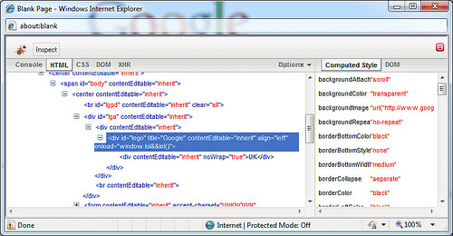

We have made a bunch of changes to [Firebug Lite](https://getfirebug.com/lite.html) over the last few months and it is about time we shared them with you. For those that don't know what Firebug Lite is, it is basically a cross browser version of Firebug. It does not have the JavaScript debugging capabilities of Firebug but is excellent for viewing the HTML and DOM structure of web pages.

We have corrected a lot of bugs and added the following enhancements:

- Open in Popup - this feature has been requested by lots of people and really improves Firebug Lite:

  <figure>

  

    <figcaption>Firebug lite in popup</figcaption>
  </figure>

- You used to be able to run the latest dev version by using a bookmarklet that worked like this:

  ```js
  var firebug = document.createElement("script");

  firebug.setAttribute(
    "src",
    "https://fbug.googlecode.com/svn/lite/branches/firebug1.2/firebug-lite.js"
  );
  document.body.appendChild(firebug);

  (function () {
    if (window.firebug.version) {
      firebug.init();
    } else {
      setTimeout(arguments.callee);
    }
  })();

  void firebug;
  ```

- Firebug Lite icon now appears at the bottom right of the page when Lite is hidden - the icon is a visual indicator that Lite is running. You can click the icon to show Lite, look at the tooltip to see hotkeys or <kbd>ctrl | &#8984;</kbd> + <kbd>click</kbd> to hide the icon.

<figure>


  <figcaption>Firebug lite icon</figcaption>
</figure>

- No more bleedthrough - there have been numerous issues with Firebug Lite being rendered behind dropdowns, Flash animations, iframes etc. This made it **very** difficult to use for some sites... we now use an iframe shield to prevent this bleedthrough.

- Added a new preference `firebug.env.detectFirebug` to prevent Lite appearing when Firebug is running - this is now the new default behavior.

- It is useful when reporting bugs to be able to let us know which version of Firebug Lite you are running. We have added the console.firebug command which displays the full version number.

- Extra Firebug Lite hotkeys - Lite can be used on a variety of platforms in a variety of browsers. Unfortunately this means that keyboard conflicts are inevitable. To work around this issue we have increased the number of hotkeys that can be used in Lite:

  - Show Firebug Lite - <kbd>F12</kbd>, <kbd>ctrl | &#8984;</kbd> + <kbd>&#8679;</kbd> + <kbd>L</kbd> or <kbd>&#8679;</kbd> + <kbd>&#9166;</kbd>
  - Open in new Window - <kbd>ctrl | &#8984;</kbd> + <kbd>F12</kbd>

- Options Dropdown - up until now it has been necessary for Lite users to set Lite options in their code in order to control Lite behavior. This is fine if you have full access to a website but it is not possible if you do not have access. To overcome this problem we have added an options dropdown to Firebug Lite. All the old `firebug.env` settings can still be set in your code but these now just set the default behavior. These settings can now also be changed from the options dropdown and are stored in cookies for each domain.

<figure>


  <figcaption>Firebug lite options dropdown</figcaption>
</figure>

- Text content is no longer trimmed - it was often frustrating that the text content in the HTML tree was trimmed to around 50 characters. This setting is now off by default and can be changed using either `firebug.env.textNodeChars` or the settings dialog.

- Hide DOM functions - another recurring issue has been that the DOM tree is slow... especially when using libraries that add a bunch of methods to the DOM. We have added an option to disable the display of DOM functions in the DOM tree. This option can be set using either `firebug.env.hideDOMFunctions` or the settings dialog.

- Handling of the same domain policy in XHR, CSS and Script tabs - in the past we always assumed that the same domain policy was active on every site. We have now changed this handling and will always attempt AJAX request (this is how we get the CSS and script text) letting you know only when there is a problem. This means that more scripts and stylesheets will be available for sites that do not use the same domain policy.

- Text nodes can now be reached via the inspect method. Unfortunately there are limitations to the inspect method in Firebug Lite. This is because of the way that browsers work... as an example imagine that you have a text node inside of a span tag, the span tag contains an onclick handler. If the text is clicked then you probably want the span element to receive the onclick event. For this reason browsers have a tendency to send the onclick event of a text node to the containing element. Because of this issue highlighting or clicking text nodes usually results in highlighting their parent elements. Nevertheless, if a text node is not contained it can now be selected.

- Lite can now be used locally over HTTPS - unfortunately Lite throws a bunch of insecure content errors when used for HTTPS pages. The only workaround is to copy the files to the domain that you wish to debug and to set `firebug.env.css` to point to the copy of the CSS file stored on that domain. Otherwise you just need to click through the warnings when they pop up.

- We have added these enhancements to Firebug Lite but would like to add more. If you have any ideas of which enhancements we should add or if you find any errors in Lite then please [log an enhancement request or issue](https://code.google.com/p/fbug/issues/list)... just don't forget to mention Firebug Lite in the subject line.
