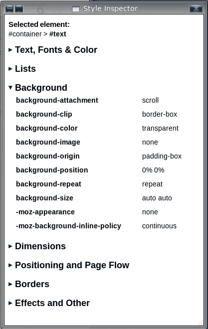

Okay, I have had the job now for over 3 months but I have really been neglecting my blog... after all, you all deserve to know about what we Mozillians are up to and we are doing some awesome things at the moment.

I have been contributing to Firebug and Firebug Lite under various guises now since about 2006 and, I may be biased but, in my opinion it is still the best web development tool ever created. I contribute mainly to the highlighter that outlines nodes on a page but all contributers fix code pretty much anywhere in the source. I remember seeing some interesting code early in 1998 concerning a special built in page triggered by typing `about:mozilla` in the address bar... this is around the time that I learned about open source software and decided that I wanted to work for Mozilla.

A couple of years after that, I started contributing to OSCommerce and around 2006 I started contributing to Joe Hewitt's [Firebug](http://www.getfirebug.com). I have seen Firebug grow from being a simple logging tool to being the fantastic web development tool that it is today. In the past couple of years [Rob Campbell](https://robcee.net/about/) contacted me a few times and told me that I should apply for a position with Mozilla. At the time I thought that all of the Firefox source code was heavy duty C++ code and that makes my eyes bleed, probably something to do with me not coming equipped with a UNIX beard.

<figure>

  <figcaption>Style Inspector</figcaption>
</figure>

Rob invited me again in January 2011 and I had a strong gut feeling that I should go for it no matter what, I could not let this fantastic opportunity pass me by after waiting for almost 14 years. I waited 4 months for Mozilla to contact me and turned down numerous permanent positions with other companies. The wait was worth it even though this position was only a 3 month contract. I would be a member of the Firefox team working on a new set of builtin [Developer Tools](http://wiki.mozilla.org/DevTools/Roadmap). The range of tools that we are building really is amazing, you will hear about them in future blog posts.

The developer tool that I have been assigned to work on is called the [style inspector](http://wiki.mozilla.org/DevTools/Features/StyleInspector). It basically displays a node's calculated styles along with displaying the CSS selectors that are responsible for that style. It also displays a list of selectors that match or do not match your node. I will blog about the tools under development, including my own so that you can have an idea what is in the pipeline.

I should point out that the DevTools project does not aim to replace Firebug. Firebug is a fantastic tool that has taken years to develop and will have a bright and shiny future... our DevTools will simply add more functionality.

We all know that to build the world's best developer toolset we need feedback from the whole range of web developers and designers. There are thousands of people around the world that are cursing browser vendors because they have not created a tool to do a particular thing. If this is you then post a comment and let us know, we can't do anything without you asking until we create the mind reading DevTool and that may be a long time in coming ;)

Does this news excite you? Have an idea for a new developer tool? Let us know by adding a comment.
