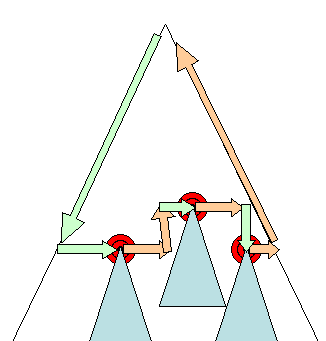
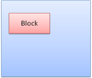
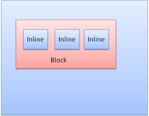

```toc

```

## Preface

This comprehensive primer on the internal operations of WebKit and Gecko is the result of much research done by Israeli developer Tali Garsiel. Over a few years, she reviewed all the published data about browser internals and spent a lot of time reading web browser source code. She wrote:

> In the years of IE 90% dominance there was nothing much to do but regard the browser as a "black box", but now, with open source browsers having [more than half of the usage share](https://techcrunch.com/2011/08/01/open-web-browsers/), it's a good time to take a peek under the engine's hood and see what's inside a web browser. Well, what's inside are millions of C++ lines...

Tali published her research on [her site](https://taligarsiel.com/), but we knew it deserved a larger audience, so we've cleaned it up and republished it here. As a web developer, **learning the internals of browser operations helps you make better decisions and know the justifications behind development best practices**.

While this is a rather lengthy document, we recommend you spend some time digging in; we guarantee you'll be glad you did.

## Introduction

Web browsers are probably the most widely used software. In this primer, I will explain how they work behind the scenes. We will see what happens when you type google.com in the address bar until you see the Google page on the browser screen.

### The Browsers We Will Talk About

There are five major browsers used today - Internet Explorer, Firefox, Safari, Chrome and Opera. I will give examples from the open source browsers - Firefox, Chrome and Safari, which is partly open source. According to the [W3C browser statistics](https://www.w3schools.com/browsers/browsers_stats.asp), currently (September 2011), the usage share of Firefox, Safari, Chrome and Opera is almost 80%. So nowdays open source browsers are a substantial part of the browser business.

### The Browser's Main Functionality

The browser main functionality is to present the web resource you choose, by requesting it from the server and displaying it on the browser window. The resource format is usually HTML but can also be PDF, image etc. The location of the resource is specified by the user using a URI (Uniform Resource Identifier). The way the browser interprets and displays HTML files is specified in the HTML and CSS specifications[^17]. These specifications are maintained by the <a id="W3C"></a>W3C (World Wide Web Consortium) organization, which is the standards organization for the web.

For years browsers conformed to only a part of the specifications and developed their own extensions. That caused serious compatibility issues for web authors. Today most of the browsers more or less conform to the specifications. Browser's user interfaces have a lot in common with each other. Among the common user interface elements are:

- Address bar for inserting the URI
- Back and forward buttons
- Bookmarking options
- Refresh and stop buttons for refreshing and stopping the loading of current documents
- Home button that gets you to your home page

Strangely enough, the browser's user interface is not specified in any formal specification, it is just good practices shaped over years of experience and by browsers imitating one another. The HTML5 specification doesn't define UI elements a browser must have, but lists some common elements. Among those are the address bar, status bar and toolbar. There are, of course, features unique to a specific browser such as Firefox download manager.

### The Browser's High Level Structure

The browser's main components[^1] are:

1. The user interface: this includes the address bar, back/forward button, bookmarking menu etc. Every part of the browser display except the main window where you see the requested page.
2. The browser engine: the interface for querying and manipulating the rendering engine.
3. The rendering engine: responsible for displaying the requested content. For example if the requested content is HTML, it is responsible for parsing the HTML and CSS and displaying the parsed content on the screen.
4. Networking: used for network calls, like HTTP requests[^10] . It has platform independent interface and underneath implementations for each platform.
5. UI backend: used for drawing basic widgets like combo boxes and windows. It exposes a generic interface that is not platform specific. Underneath it uses the operating system user interface methods.
6. JavaScript interpreter. Used to parse and execute the JavaScript code.
7. Data storage. This is a persistence layer. The browser needs to save some data to the hard disk, e.g cookies. The HTML5 specification includes 'web database' which is a complete (although light) database in the browser.

<figure>


  <figcaption>Figure 1: Browser Main Components</figcaption>
</figure>

It is important to note that Chrome, unlike most browsers, holds multiple instances of the rendering engine - one for each tab. Each tab is a separate process.

### Communication Between the Components

Both Firefox and Chrome developed a special communication infrastructures.

## The Rendering Engine

The responsibility of the rendering engine is well... rendering, that is display of the requested contents on the browser screen. By default the rendering engine can display HTML and XML documents and images. It can display other types through plug-ins (browser extensions). An example is displaying a PDF using a PDF viewer plug-in. Here we will focus on the main use case - displaying HTML and images that are formatted using CSS.

### Rendering Engines

Our reference browsers - Firefox, Chrome and Safari are built upon two rendering engines. Firefox[^18] uses Gecko - a "home made" Mozilla rendering engine. Both Safari and Chrome use WebKit. WebKit[^19] is an open source rendering engine which started as an engine for the Linux platform and was modified by Apple to support Mac and Windows. See [https://webkit.org/](https://webkit.org/) for more details.

### The Main Flow

The rendering engine will start getting the contents of the requested document from the networking layer. This will usually be done in 8K chunks. After that this is the basic flow of the rendering engine:

<figure>


  <figcaption>Figure 2: Rendering engine basic flow</figcaption>
</figure>

The rendering engine will start parsing the HTML document and turn the tags to [DOM](#DOM) nodes in a tree called the "content tree".

It will parse the style data, both in external CSS files and in style elements. The styling information together with visual instructions in the HTML will be used to create another tree - the [render tree](#render-tree-construction). The render tree contains rectangles with visual attributes like color and dimensions. The rectangles are in the right order to be displayed on the screen. After the construction of the render tree it goes through a "[layout](#layout)" process. This means giving each node the exact coordinates where it should appear on the screen.

The next stage is [painting](#Painting). The render tree will be traversed and each node will be painted using the UI backend layer. It's important to understand that this is a gradual process. For better user experience, the rendering engine will try to display contents on the screen as soon as possible. It will not wait until all HTML is parsed before starting to build and layout the render tree. Parts of the content will be parsed and displayed, while the process continues with the rest of the contents that keeps coming from the network.

### Main Flow Examples

<figure>


  <figcaption>Figure 3: WebKit main flow</figcaption>
</figure>

<figure>


  <figcaption>Figure 4: Mozilla's Gecko rendering engine main flow</figcaption>
</figure>

From figures 3 and 4 you can see that although WebKit and Gecko[^9] use slightly different terminology, the flow is basically the same. Gecko calls the tree of visually formatted elements the Frame tree. Each element is a frame. WebKit uses the term "Render Tree" and it consists of "Render Objects". WebKit uses the term "layout" for the placing of elements, while Gecko calls it "Reflow". "Attachment" is WebKit's term for connecting DOM nodes and visual information to create the render tree. A minor non semantic difference is that Gecko has an extra layer between the HTML and the DOM tree. It is called the "content sink" and is a factory for making DOM elements. We will talk about each part of the flow:

### Parsing and DOM Tree Construction

#### Parsing - General

Since parsing is a very significant process within the rendering engine, we will go into it a little more deeply. Let's begin with a little introduction about parsing[^2].

Parsing a document means translating it to some structure that makes sense - something the code can understand and use. The result of parsing is usually a tree of nodes that represent the structure of the document. It is called a parse tree or a syntax tree.

For example - parsing the expression `2 + 3 - 1` could return this tree:

<figure>


  <figcaption>Figure 5: Mathematical expression node tree</figcaption>
</figure>

##### Grammars

Parsing is based on the syntax rules the document obeys - the language or format it was written in. Every format you can parse must have deterministic grammar consisting of vocabulary and syntax rules. It is called a [context free grammar](#context_free_grammar). Human languages are not such consistent languages and therefore cannot be parsed with conventional parsing techniques.

##### Parser - Lexer Combination

Parsing can be separated into two sub processes - lexical analysis and syntax analysis. Lexical analysis is the process of breaking the input into tokens. Tokens are the language vocabulary - the collection of valid building blocks. In human language it will consist of all the words that appear in the dictionary for that language. Syntax analysis is the applying of the language syntax rules.

Parsers usually divide the work between two components - the **lexer** (sometimes called **tokenizer**) that is responsible for breaking the input into valid tokens, and the **parser** that is responsible for constructing the parse tree by analyzing the document structure according to the language syntax rules. The lexer knows how to strip irrelevant characters like white spaces and line breaks.

<figure>


  <figcaption>Figure 6: From source document to parse trees</figcaption>
</figure>

The parsing process is iterative. The parser will usually ask the lexer for a new token and try to match the token with one of the syntax rules. If a rule is matched, a node corresponding to the token will be added to the parse tree and the parser will ask for another token. If no rule matches, the parser will store the token internally, and keep asking for tokens until a rule matching all the internally stored tokens is found. If no rule is found then the parser will raise an exception. This means the document was not valid and contained syntax errors.

##### Translation

Many times the parse tree is not the final product. Parsing is often used in translation - transforming the input document to another format. One example is compilation. The compiler that compiles a program into machine code first parses it into a parse tree and then translates the tree into a machine code document.

<figure>


  <figcaption>Figure 7: Compilation flow</figcaption>
</figure>

##### Parsing Example

In figure 5 we built a parse tree from a mathematical expression. Let's try to define a simple mathematical language and see the parse process. Vocabulary: Our language can include integers, plus signs and minus signs. Syntax:

1. The language syntax building blocks are expressions, terms and operations.
2. Our language can include any number of expressions.
3. A expression is defined as a "term" followed by an "operation" followed by another term
4. An operation is a plus token or a minus token
5. A term is an integer token or an expression

Let's analyze the input `2 + 3 - 1`. The first substring that matches a rule is `2`, according to rule #5 it is a term. The second match is `2 + 3` this matches the second rule - a term followed by an operation followed by another term. The next match will only be hit at the end of the input. `2 + 3 - 1` is an expression because we already know that `2 + 3` is a term so we have a term followed by an operation followed by another term. `2 + +` will not match any rule and therefore is an invalid input.

##### Formal Definitions for Vocabulary and Syntax

Vocabulary is usually expressed by [regular expressions](https://www.regular-expressions.info/). For example our language will be defined as:

<figure>

```js
INTEGER: 0|[1-9][0-9]*
PLUS:    +
MINUS:   -
```

  <figcaption>Example of our language in BNF</figcaption>
</figure>

As you see, integers are defined by a regular expression. Syntax is usually defined in a format called [BNF](https://en.wikipedia.org/wiki/Backus%E2%80%93Naur_Form). Our language will be defined as:

<figure>

```js
expression := term operation term
operation  := PLUS | MINUS
term       := INTEGER | expression
```

  <figcaption>Language definition in BNF</figcaption>
</figure>

We said that a language can be parsed by regular parsers if its grammar is a <a id="context_free_grammar"></a>context free grammar. An intuitive definition of a context free grammar is a grammar that can be entirely expressed in BNF. For a formal definition see [https://en.wikipedia.org/wiki/Context-free_grammar](https://en.wikipedia.org/wiki/Context-free_grammar)

##### Types of Parsers

There are two basic types of parsers - top down parsers and bottom up parsers. An intuitive explanation is that top down parsers see the high level structure of the syntax and try to match one of them. Bottom up parsers start with the input and gradually transform it into the syntax rules, starting from the low level rules until high level rules are met. Let's see how the two types of parsers will parse our example:

A top down parser starts from the higher level rule - it identifies `2 + 3` as an expression. It will then identify `2 + 3 - 1` as an expression (the process of identifying the expression evolves matching the other rules, but the start point is the highest level rule).

The bottom up parser will scan the input until a rule is matched it will then replace the matching input with the rule. This will go on until the end of the input. The partly matched expression is placed on the parsers stack.

| Stack                |     Input |
| -------------------- | --------: |
|                      | 2 + 3 - 1 |
| Term                 |   + 3 - 1 |
| Term Operation       |     3 - 1 |
| Expression           |       - 1 |
| Expression operation |         1 |
| Expression           |           |

This type of bottom up parser is called a shift reduce parser, because the input is shifted to the right (imagine a pointer pointing first at the input start and moving to the right) and is gradually reduced to syntax rules.

##### Generating Parsers Automatically

There are tools that can generate a parser for you. They are called parser generators. You feed them with the grammar of your language - its vocabulary and syntax rules and they generate a working parser. Creating a parser requires a deep understanding of parsing and its not easy to create an optimized parser by hand, so parser generators can be very useful.

WebKit uses two well known parser generators - Flex for creating a lexer and Bison for creating a parser (you might run into them with the names Lex and Yacc). Flex input is a file containing regular expression definitions of the tokens. Bison's input is the language syntax rules in BNF format.

#### HTML Parser

The job of the HTML parser is to parse the HTML markup into a parse tree.

##### The HTML Grammar Definition

The vocabulary and syntax of HTML are defined in [specifications](#W3C) created by the W3C organization. The current version is HTML4 and work on HTML5 is in progress.

##### Not a Context Free Grammar

As we have seen in the parsing introduction, grammar syntax can be defined formally using formats like BNF. Unfortunately not all of the conventional parser topics apply to HTML (I didn't bring them up just for fun - they will be used in parsing CSS and JavaScript). HTML cannot easily be defined by a context free grammar that parsers need.

There is a formal format for defining HTML - DTD (Document Type Definition) - but it is not a context free grammar. This appears strange at first site - HTML is rather close to XML. There are lots of available XML parsers. There is an XML variation of HTML - XHTML - so what's the big difference? The difference is that HTML approach is more "forgiving", it lets you omit certain tags which are added implicitly, sometimes omit the start or end of tags etc.

On the whole it's a "soft" syntax, as opposed to XML's stiff and demanding syntax. Apparently this seemingly small difference makes a world of a difference. On one hand this is the main reason why HTML is so popular - it forgives your mistakes and makes life easy for the web author. On the other hand, it makes it difficult to write a format grammar. So to summarize - HTML cannot be parsed easily, not by conventional parsers since its grammar is not a context free grammar, and not by XML parsers.

##### HTML DTD

HTML definition is in a DTD format. This format is used to define languages of the [SGML](https://en.wikipedia.org/wiki/Standard_Generalized_Markup_Language) family. The format contains definitions for all allowed elements, their attributes and hierarchy. As we saw earlier, the HTML DTD doesn't form a context free grammar. There are a few variations of the DTD. The strict mode conforms solely to the specifications but other modes contain support for markup used by browsers in the past. The purpose is backwards compatibility with older content. The current strict DTD is at [https://www.w3.org/TR/html4/strict.dtd](https://www.w3.org/TR/html4/strict.dtd)

##### DOM

The output tree - the parse tree is a tree of DOM element and attribute nodes. DOM is short for Document Object Model. It is the object presentation of the HTML document and the interface of HTML elements to the outside world like JavaScript. The root of the tree is the "[document](https://www.w3.org/TR/1998/REC-DOM-Level-1-19981001/level-one-core.html#i-Document)" object.

The DOM has an almost one to one relation to the markup. Example, this markup:

<figure>

```html
<html>
  <body>
    <p>Hello World</p>
    <div></div>
  </body>
</html>
```

  <figcaption>Example markup</figcaption>
</figure>

Would be translated to the following DOM tree:

<figure>


  <figcaption>Figure 8: DOM tree of the example markup</figcaption>
</figure>

Like HTML, DOM is specified by the W3C organizationm see [https://www.w3.org/DOM/DOMTR](https://www.w3.org/DOM/DOMTR). It is a generic specification for manipulating documents. A specific module describes HTML specific elements. The HTML definitions can be found here: [https://www.w3.org/TR/2003/REC-DOM-Level-2-HTML-20030109/idl-definitions.html](https://www.w3.org/TR/2003/REC-DOM-Level-2-HTML-20030109/idl-definitions.html). When we say the tree contains DOM nodes, we mean the tree is constructed of elements that implement one of the DOM interfaces. Browsers use concrete implementations that have other attributes used by the browser internally.

##### The Parsing Algorithm

As we saw in the previous sections, HTML cannot be parsed using the regular top down or bottom up parsers. The reasons are:

- The forgiving nature of the language.
- The fact that browsers have traditional error tolerance to support well known cases of invalid HTML.
- The parsing process in reentrant. Usually the source doesn't change during parsing, but in HTML, script tags containing "document.write" can add extra tokens, so the parsing process actually modifies the input.

Unable to use the regular parsing techniques, browsers create custom parsers for parsing HTML. The parsing algorithm is described in details by the HTML5 specification. The algorithm consists of two stages - tokenization and tree construction. Tokenization is the lexical analysis, parsing the input into tokens. Among HTML tokens are start tags, end tags, attribute names and attribute values. The tokenizer recognizes the token, gives it to the tree constructor and consumes the next character for recognizing the next token and so on until the end of the input.

<figure>


  <figcaption>Figure 9: HTML Parsing Flow</figcaption>
</figure>

##### The Tokenization Algorithm

The algorithm's output is an HTML token. The algorithm is expressed as a state machine. Each state consumes one or more characters of the input stream and updates the next state according to those characters. The decision is influenced by the current tokenization state and by the tree construction state. This means the same consumed character will yield different results for the correct next state, depending on the current state. The algorithm is too complex to bring fully, so let's see a simple example that will help us understand the principal.

Basic example - tokenizing the following HTML:

<figure>

```html
<html>
  <body>
    Hello world
  </body>
</html>
```

  <figcaption>The HTML to be tokenized</figcaption>
</figure>

1. The initial state is the "Data state". When the `<` character is encountered, the state is changed to **"Tag open state"**.
2. Consuming an "a-z" character causes creation of a "Start tag token", the state is changed to **"Tag name state"**.
3. We stay in this state until the `>` character is consumed. Each character is appended to the new token name. In our case the created token is an "HTML" token.
4. When the `>` tag is reached, the current token is emitted and the state changes back to the **"Data state"**.
5. The `<body>` tag will be treated by the same steps. So far the "html" and "body" tags were emitted. We are now back at the **"Data state"**.
6. Consuming the "H" character of "Hello world" will cause creation and emitting of a character token, this goes on until the `>` of `<body>` is reached.
7. We will emit a character token for each character of "Hello world". We are now back at the **"Tag open state"**.
8. Consuming the next input "/" will cause creation of an "end tag token" and a move to the **"Tag name state"**.
9. Again we stay in this state until we reach `>`.Then the new tag token will be emitted and we go back to the **"Data state"**.
10. The `<html>` input will be treated like the previous case.

<figure>


  <figcaption>Figure 10: Tokenizing the example input</figcaption>
</figure>

##### Tree Construction Algorithm

When the parser is created the document object is created. During the tree construction stage the DOM tree with the document in its root will be modified and elements will be added to it. Each node emitted by the tokenizer will be processed by the tree constructor. For each token the specification defines which DOM element is relevant to it and will be created for this token. Except of adding the element to the DOM tree it is also added to a stack of open elements.

This stack is used to correct nesting mismatches and unclosed tags. The algorithm is also described as a state machine. The states are called "insertion modes." Let's see the tree construction process for the example input:

<figure>

```html
<html>
  <body>
    Hello world
  </body>
</html>
```

  <figcaption>Example input</figcaption>
</figure>

The input to the tree construction stage is a sequence of tokens from the tokenization stage:

1. The first mode is the **"initial mode"**.
2. Receiving the HTML token will cause a move to the **"before html"** mode and a reprocessing of the token in that mode.
3. This will cause a creation of the HTMLHtmlElement element and it will be appended to the root document object. The state will be changed to **"before head."**
4. We receive the "body" token. An HTMLHeadElement will be created implicitly although we don't have a "head" token and it will be added to the tree.
5. We now move to the **"in head"** mode and then to **"after head"**.
6. The body token is reprocessed, an HTMLBodyElement is created and inserted and the mode is transferred to **"in body."**
7. The character tokens of the "Hello world" string are now received.
8. The first one will cause creation and insertion of a "Text" node and the other characters will be appended to that node.
9. The receiving of the body end token will cause a transfer to **"after body"** mode.
10. We will now receive the HTML end tag which will move us to **"after after body"** mode.
11. Receiving the end of file token will end the parsing.

<figure>


  <figcaption>Figure 11: Tree construction of example HTML</figcaption>
</figure>

##### Actions When the Parsing is Finished

At this stage the browser will mark the document as interactive and start parsing scripts that are in "deferred" mode - those who should be executed after the document is parsed. The document state will then be set to "complete" and a "load" event will be fired. You can see the full algorithms for tokenization and tree construction in HTML5 specification - [https://www.w3.org/TR/html5/syntax.html#html-parser](https://www.w3.org/TR/html5/syntax.html#html-parser)

##### Browsers Error Tolerance

You never get an "Invalid Syntax" error on an HTML page. Browsers fix an invalid content and go on. Take this HTML for example:

<figure>

```html
<html>
  <mytag>
  </mytag>
  <div>
  <p>
  </div>
    Really lousy HTML
  </p>
</html>
```

  <figcaption>Terrible HTML</figcaption>
</figure>

I must have violated about a million rules ("mytag" is not a standard tag, wrong nesting of the "p" and "div" elements and more) but the browser still shows it correctly and doesn't complain. So a lot of the parser code is fixing the HTML author's mistakes. The error handling is quite consistent in browsers but amazingly enough it's not part of HTML current specification. Like bookmarking and back/forward buttons it's just something that developed in browsers over the years.

There are known invalid HTML constructs that repeat themselves in many sites and the browsers try to fix them in a conformant way with other browsers. The HTML5 specification does define some of these requirements. WebKit summarizes this nicely in the comment at the beginning of the HTML parser class.

> The parser parses tokenized input into the document, building up the document tree. If the document is well-formed, parsing it is straightforward. Unfortunately, we have to handle many HTML documents that are not well-formed, so the parser has to be tolerant about errors. We have to take care of at least the following error conditions:
>
> 1. The element being added is explicitly forbidden inside some outer tag. In this case we should close all tags up to the one, which forbids the element, and add it afterwards.
> 2. We are not allowed to add the element directly. It could be that the person writing the document forgot some tag in between (or that the tag in between is optional). This could be the case with the following tags: HTML HEAD BODY TBODY TR TD LI (did I forget any?).
> 3. We want to add a block element inside to an inline element. Close all inline elements up to the next higher block element.
> 4. If this doesn't help, close elements until we are allowed to add the element or ignore the tag.

Let's see some WebKit error tolerance examples:

###### &lt;/br&gt; Instead of &lt;br&gt;

Some sites use `</br>` instead of `<br>`. In order to be compatible with IE and Firefox WebKit treats this like `<br>`.

The code:

<figure>

```cpp
if (t->isCloseTag(brTag) && m_document->inCompatMode()) {
     reportError(MalformedBRError);
     t->beginTag = true;
}
```

  <figcaption>How WebKit treats &lt;/br&gt; as &lt;br&gt;</figcaption>
</figure>

Note: The error handling is internal - it won't be presented to the user.

###### A Stray Table

A stray table is a table inside another tables contents but not inside a table cell.

For example:

<figure>

```html
<table>
  <table>
    <tr>
      <td>inner table</td>
    </tr>
  </table>
  <tr>
    <td>outer table</td>
  </tr>
</table>
```

  <figcaption>HTML resulting in a stray table</figcaption>
</figure>

WebKit will change the hierarchy to two sibling tables:

<figure>

```html
<table>
  <tr>
    <td>outer table</td>
  </tr>
</table>
<table>
  <tr>
    <td>inner table</td>
  </tr>
</table>
```

  <figcaption>WebKit creates two sibling tables</figcaption>
</figure>

The code:

<figure>

```cpp
if (m_inStrayTableContent && localName == tableTag)
  popBlock(tableTag);
```

  <figcaption>WebKit's code that creates the siblings</figcaption>
</figure>

WebKit uses a stack for the current element contents - it will pop the inner table out of the outer table stack. The tables will now be siblings.

###### Nested Form Elements

In case the user puts a form inside another form, the second form is ignored. The code:

<figure>

```cpp
if (!m_currentFormElement) {
  m_currentFormElement = new HTMLFormElement(formTag, m_document);
}
```

  <figcaption>Forms inside forms are ignored</figcaption>
</figure>

###### A Too Deep Tag Hierarchy

The quote speaks for itself:

> https://www.liceo.edu.mx/ is an example of a site that achieves a level of nesting of about 1500 tags, all from a bunch of `<b>` tags. We will only allow at most 20 nested tags of the same type before just ignoring them all together.

<figure>

```cpp
bool HTMLParser::allowNestedRedundantTag(const AtomicString& tagName)
{
  unsigned i = 0;
  for (HTMLStackElem* curr = m_blockStack;
    i < cMaxRedundantTagDepth && curr && curr->tagName == tagName;
    curr = curr->next, i++) { }

  return i != cMaxRedundantTagDepth;
}
```

  <figcaption>Only allow tags nested up to 20 deep</figcaption>
</figure>

###### Misplaced HTML or body End Tags

Again - the comment speaks for itself. Support for really broken html. We never close the body tag, since some stupid web pages close it before the actual end of the doc. Let's rely on the end() call to close things:

<figure>

```cpp
if (t->tagName == htmlTag || t->tagName == bodyTag )
  return;
```

  <figcaption>body and HTML tags are only closed on the end call</figcaption>
</figure>

So web authors beware - unless you want to appear as an example in a WebKit error tolerance code - write well formed HTML.

#### CSS Parsing

Remember the parsing concepts in the introduction[^7]? Well, unlike HTML, CSS is a context free grammar and can be parsed using the types of parsers described in the introduction. In fact the CSS specification defines CSS lexical and syntax grammar ([https://www.w3.org/TR/CSS2/grammar.html](https://www.w3.org/TR/CSS2/grammar.html)).

Let's see some examples:

The lexical grammar (vocabulary) is defined by regular expressions for each token:

<figure>

```js
comment   \/\*[^*]*\*+([^/*][^*]*\*+)*\/
num       [0-9]+|[0-9]*"."[0-9]+
nonascii  [\200-\377]
nmstart   [_a-z]|{nonascii}|{escape}
nmchar    [_a-z0-9-]|{nonascii}|{escape}
name      {nmchar}+
ident     {nmstart}{nmchar}*
```

  <figcaption>Lexical grammar (vocabulary)</figcaption>
</figure>

"ident" is short for identifier, like a class name. "name" is an element id (that is referred by "#" )

The syntax grammar is described in BNF:

<figure>

```js
ruleset
  : selector [ ',' S* selector ]*
    '{' S* declaration [ ';' S* declaration ]* '}' S*
  ;
selector
  : simple_selector [ combinator selector | S+ [ combinator? selector ]? ]?
  ;
simple_selector
  : element_name [ HASH | class | attrib | pseudo ]*
  | [ HASH | class | attrib | pseudo ]+
  ;
class
  : '.' IDENT
  ;
element_name
  : IDENT | '*'
  ;
attrib
  : '[' S* IDENT S* [ [ '=' | INCLUDES | DASHMATCH ] S*
    [ IDENT | STRING ] S* ] ']'
  ;
pseudo
  : ':' [ IDENT | FUNCTION S* [IDENT S*] ')' ]
  ;
```

  <figcaption>Syntax grammar</figcaption>
</figure>

Explanation: A ruleset is this structure:

<figure>

```css
div.error,
a.error {
  color: red;
  font-weight: bold;
}
```

  <figcaption>A ruleset</figcaption>
</figure>

div.error and a.error are selectors. The part inside the curly braces contains the rules that are applied by this ruleset. This structure is defined formally in this definition:

<figure>

```js
ruleset
  : selector [ ',' S* selector ]*
    '{' S* declaration [ ';' S* declaration ]* '}' S*
  ;
```

  <figcaption>The structure definition</figcaption>
</figure>

This means a ruleset is a selector or optionally number of selectors separated by a coma and spaces (S stands for white space). A ruleset contains curly braces and inside them a declaration or optionally a number of declarations separated by a semicolon. "declaration" and "selector" will be defined in the following BNF definitions.

##### WebKit CSS Parser

WebKit uses [Flex and Bison](#generating-parsers-automatically) parser generators to create parsers automatically from the CSS grammar files. As you may recall from the parser introduction, Bison creates a bottom up shift reduce parser. Firefox uses a top down parser written manually. In both cases each CSS file is parsed into a StyleSheet object, each object contains CSS rules. The CSS rule objects contain selector and declaration objects and other object corresponding to CSS grammar.

<figure>


  <figcaption>Figure 12: Parsing CSS</figcaption>
</figure>

#### Parsing Scripts

#### The Order of Processing Scripts and Stylesheets

##### Scripts

The model of the web is synchronous. Authors expect scripts to be parsed and executed immediately when the parser reaches a `<script>` tag. The parsing of the document halts until the script is executed. If the script is external then the resource must be first fetched from the network - this is also done synchronously, the parsing halts until the resource is fetched. This was the model for many years and is also specified in HTML 4[^15] and 5[^16] specifications. Authors could mark the script as "defer" and thus it will not halt the document parsing and will execute after it is parsed. HTML5 adds an option to mark the script as asynchronous so it will be parsed and executed by a different thread.

##### Speculative Parsing

Both WebKit and Firefox perform this optimization. While executing scripts, another thread parses the rest of the document and finds out which other resources need to be loaded from the network and loads them. This way resources can be loaded on parallel connections and the overall speed is better.

Note: the speculative parser doesn't modify the DOM tree and leaves that to the main parser, it only parses references to external resources like external scripts, style sheets and images.

##### Stylesheets

Stylesheets on the other hand have a different model. Conceptually it seems that since style sheets don't change the DOM tree, there is no reason to wait for them and stop the document parsing. There is an issue, though, of scripts asking for style information during the document parsing stage. If the style is not loaded and parsed yet, the script will get wrong answers and apparently this caused lots of problems[^14]. It seems to be an edge case but is actually fairly common. Firefox blocks all scripts when there is a stylesheet that is still being loaded and parsed. WebKit blocks scripts only when they try to access certain style properties that may be effected by unloaded stylesheets.

### Render Tree Construction

While the DOM tree is being constructed, the browser constructs another tree, the render tree. This is a tree of visual elements in the order in which they will be displayed. It is the visual representation of the document. The purpose of this tree is to enable painting the contents in their correct order. Firefox calls the elements in the render tree "frames". WebKit uses the term renderer or render object. A renderer knows how to layout and paint itself and it's children. WebKit's RenderObject class, the base class of the renderers has the following definition:

<figure>

```cpp
class RenderObject {
  virtual void layout();
  virtual void paint(PaintInfo);
  virtual void rect repaintRect();
  Node* node;  //the DOM node
  RenderStyle* style;  // the computed style
  RenderLayer* containgLayer; //the containing z-index layer
}
```

  <figcaption>WebKit's RenderObject Class</figcaption>
</figure>

Each renderer represents a rectangular area usually corresponding to the node's CSS box, as described by the CSS2 spec. It contains geometric information like width, height and position.

The box type is affected by the "display" style attribute that is relevant for the node (see the [style computation](#style-computation) section). Here is WebKit code for deciding what type of renderer should be created for a DOM node, according to the display attribute.

<figure>

```cpp
RenderObject* RenderObject::createObject(Node* node, RenderStyle* style)
{
    Document* doc = node->document();
    RenderArena* arena = doc->renderArena();
    ...
    RenderObject* o = 0;

    switch (style->display()) {
        case NONE:
            break;
        case INLINE:
            o = new (arena) RenderInline(node);
            break;
        case BLOCK:
            o = new (arena) RenderBlock(node);
            break;
        case INLINE_BLOCK:
            o = new (arena) RenderBlock(node);
            break;
        case LIST_ITEM:
            o = new (arena) RenderListItem(node);
            break;
       ...
    }

    return o;
}
```

  <figcaption>WebKit's RenderObject::createObject method</figcaption>
</figure>

The element type is also considered, for example form controls and tables have special frames. In WebKit if an element wants to create a special renderer it will override the `createRenderer()` method. The renderers points to style objects that contains the non geometric information.

#### The Render Tree Relation to the DOM Tree

The renderers correspond to the DOM elements, but the relation is not one to one. Non visual DOM elements will not be inserted in the render tree. An example is the "head" element. Also elements whose display attribute was assigned to "none" will not appear in the tree (elements with "hidden" visibility attribute will appear in the tree)[^4][^5].

There are DOM elements which correspond to several visual objects. These are usually elements with complex structures that cannot be described by a single rectangle. For example, the "select" element has 3 renderers - one for the display area, one for the drop down list box and one for the button. Also when text is broken into multiple lines because the width is not sufficient for one line, the new lines will be added as extra renderers. Another example of several renderers is broken HTML.

According to CSS spec an inline element must contain either only block elements or only inline elements. In case of mixed content, anonymous block renderers will be created to wrap the inline elements. Some render objects correspond to a DOM node but not in the same place in the tree. Floats and absolutely positioned elements are out of flow, placed in a different place in the tree, and mapped to the real frame. A placeholder frame is where they should have been.

<figure>


  <figcaption>Figure 13: The render tree and the corresponding DOM tree</figcaption>
</figure>

#### The Flow of Constructing the Tree

In Firefox, the presentation is registered as a listener for DOM updates. The presentation delegates frame creation to the "FrameConstructor" and the constructor resolves style (see [style computation](#style-computation)) and creates a frame. In WebKit the process of resolving the style and creating a renderer is called "attachment". Every DOM node has an "attach" method. Attachment is synchronous, node insertion to the DOM tree calls the new node "attach" method.

Processing the html and body tags results in the construction of the render tree root. The root render object corresponds to what the CSS spec calls the containing block - the top most block that contains all other blocks. Its dimensions are the viewport - the browser window display area dimensions. Firefox calls it ViewPortFrame and WebKit calls it RenderView. This is the render object that the document point to. The rest of the tree is constructed as a DOM nodes insertion. See CSS2 on this topic - [https://www.w3.org/TR/CSS21/intro.html#processing-model](https://www.w3.org/TR/CSS21/intro.html#processing-model)

#### Style Computation

Building the render tree requires calculating the visual properties of each render object. This is done by calculating the style properties of each element. The style includes stylesheets of various origins, inline style elements and visual properties in the HTML (like the `bgcolor` property). The latter is translated to matching CSS style properties. The origins of style sheets are the browser's default style sheets, the style sheets provided by the page author and user style sheets - these are style sheets provides by the browser user (browsers let you define your favorite style. In Firefox, for instance, this is done by placing a style sheet in the "Firefox Profile" folder). Style computation brings up a few difficulties:

1. <a id="issue1"></a>Style data is a very large construct, holding the numerous style properties, this can cause memory problems.
2. <a id="issue2"></a>Finding the matching rules for each element can cause performance issues if it's not optimized. Traversing the entire rule list for each element to find matches is a heavy task. Selectors can have complex structure that can cause the matching process to start on a seemingly promising path that is proven to be futile and another path has to be tried. For example - this compound selector `div div div div {... }` means the rules apply to a `<div>` which is the descendant of 3 divs. Suppose you want to check if the rule applies for a given `<div>` element. You choose a certain path up the tree for checking. You may need to traverse the node tree up just to find out there are only two divs and the rule does not apply. You then need to try other paths in the tree.
3. <a id="issue3"></a>Applying the rules involves quite complex cascade rules that define the hierarchy of the rules.

Let's see how the browsers face these issues:

##### Sharing Style Data

WebKit nodes references style objects (RenderStyle). These objects can be shared by nodes in some conditions. The nodes are siblings or cousins and:

1. The elements must be in the same mouse state (e.g., one can't be in :hover while the other isn't)
2. Neither element should have an id
3. The tag names should match
4. The class attributes should match
5. The set of mapped attributes must be identical
6. The link states must match
7. The focus states must match
8. Neither element should be affected by attribute selectors, where affected is defined as having any selector match that uses an attribute selector in any position within the selector at all
9. There must be no inline style attribute on the elements
10. There must be no sibling selectors in use at all. WebCore[^12] simply throws a global switch when any sibling selector is encountered and disables style sharing for the entire document when they are present. This includes the + selector and selectors like :first-child and :last-child.

##### Firefox Rule Tree

Firefox has two extra trees for easier style computation - the rule tree and style context tree[^3]. WebKit also has style objects but they are not stored in a tree like the style context tree, only the DOM node points to its relevant style.

<figure>


  <figcaption>Figure 14: Firefox Style Content Tree</figcaption>
</figure>

The style contexts contain end values. The values are computed by applying all the matching rules in the correct order and performing manipulations that transform them from logical to concrete values. For example - if the logical value is percentage of the screen it will be calculated and transformed to absolute units. The rule tree idea is really clever. It enables sharing these values between nodes to avoid computing them again. This also saves space. All the matched rules are stored in a tree. The bottom nodes in a path have higher priority. The tree contains all the paths for rule matches that were found. Storing the rules is done lazily. The tree isn't calculated at the beginning for every node, but whenever a node style needs to be computed the computed paths are added to the tree. The idea is to see the tree paths as words in a lexicon. Let's say we already computed this rule tree:

<figure>


  <figcaption>Figure 15: Computed Rule Tree</figcaption>
</figure>

Suppose we need to match rules for another element in the content tree, and find out the matched rules (in the correct order) are `B - E - I`. We already have this path in the tree because we already computed path `A - B - E - I - L`. We will now have less work to do. Let's see how the tree saves as work.

###### Division Into Structs

The style contexts are divided into structs. Those structs contain style information for a certain categories like border or color. All the properties in a struct are either inherited or non inherited. Inherited properties are properties that unless defined by the element, are inherited from its parent. Non inherited properties (called "reset" properties) use default values if not defined. The tree helps us by caching entire structs (containing the computed end values) in the tree. The idea is that if the bottom node didn't supply a definition for a struct, a cached struct in an upper node can be used.

###### Computing the Style Contexts Using the Rule Tree

When computing the style context for a certain element, we first compute a path in the rule tree or use an existing one. We then begin to apply the rules in the path to fill the structs in our new style context. We start at the bottom node of the path - the one with the highest precedence (usually the most specific selector) and traverse the tree up until our struct is full. If there is no specification for the struct in that rule node, then we can greatly optimize - we go up the tree until we find a node that specifies it fully and simply point to it - that's the best optimization - the entire struct is shared. This saves computation of end values and memory.

If we find partial definitions we go up the tree until the struct is filled.

If we didn't find any definitions for our struct, then in case the struct is an "inherited" type - we point to the struct of our parent in the **context tree**, in this case we also succeeded in sharing structs. If its a reset struct then default values will be used.

If the most specific node does add values then we need to do some extra calculations for transforming it to actual values. We then cache the result in the tree node so it can be used by children.

In case an element has a sibling or a brother that points to the same tree node then the **entire style context** can be shared between them.

Lets see an example, suppose we have this HTML:

<figure>

```html
<html>
  <body>
    <div class="err" id="div1">
      <p>
        this is a <span class="big"> big error </span>
        this is also a
        <span class="big"> very big error</span> error
      </p>
    </div>
    <div class="err" id="div2">another error</div>
  </body>
</html>
```

  <figcaption>Similar CSS classes share the same style context</figcaption>
</figure>

And the following rules:

<figure>

```css
div {
  margin: 5px;
  color: black;
}
.err {
  color: red;
}
.big {
  margin-top: 3px;
}
div span {
  margin-bottom: 4px;
}
#div1 {
  color: blue;
}
#div2 {
  color: green;
}
```

  <figcaption>The CSS</figcaption>
</figure>

To simplify things let's say we need to fill out only two structs - the color struct and the margin struct. The color struct contains only one member - the color. The margin struct contains the four sides. The resulting rule tree will look like this (the nodes are marked with the node name : the # of rule they point at):

<figure>


  <figcaption>Figure 16: The Rule Tree</figcaption>
</figure>

The context tree will look like this (node name : rule node they point to):

<figure>


  <figcaption>Figure 17: The Context Tree</figcaption>
</figure>

Suppose we parse the HTML and get to the second `<div>` tag. We need to create a style context for this node and fill its style structs. We will match the rules and discover that the matching rules for the `<div>` are 1 ,2 and 6. This means there is already an existing path in the tree that our element can use and we just need to add another node to it for rule 6 (node F in the rule tree). We will create a style context and put it in the context tree. The new style context will point to node F in the rule tree.

We now need to fill the style structs. We will begin by filling out the margin struct. Since the last rule node(F) doesn't add to the margin struct, we can go up the tree until we find a cached struct computed in a previous node insertion and use it. We will find it on node B, which is the uppermost node that specified margin rules. We do have a definition for the color struct, so we can't use a cached struct. Since color has one attribute we don't need to go up the tree to fill other attributes. We will compute the end value (convert string to RGB etc) and cache the computed struct on this node.

The work on the second `<span>` element is even easier. We will match the rules and come to the conclusion that it points to rule G, like the previous span. Since we have siblings that point to the same node, we can share the entire style context and just point to the context of the previous span.

For structs that contain rules that are inherited from the parent, caching is done on the context tree (the color property is actually inherited, but Firefox treats it as reset and caches it on the rule tree).

For instance if we added rules for fonts in a paragraph:

<figure>

```css
p {
  font-family: Verdana;
  font size: 10px;
  font-weight: bold;
}
```

  <figcaption>Rules for fonts in a paragraph</figcaption>
</figure>

Then the paragraph element, which is a child of the div in the context tree, could have shared the same font struct as his parent. This is if no font rules where specified for the paragraph.

In WebKit, who does not have a rule tree, the matched declarations are traversed four times. First non-important high priority properties are applied (properties that should be applied first because others depend on them, such as display), then high priority important, then normal priority non-important, then normal priority important rules. This means that properties that appear multiple times will be resolved according to the correct cascade order. The last wins.

So to summarize: sharing the style objects (entirely or some of the structs inside them) solves issues [1](#issue1) and [3](#issue3). The Firefox rule tree also helps in applying the properties in the correct order.

##### Manipulating the Rules for an Easy Match

There are several sources for style rules:

- CSS rules, either in external style sheets or in style elements:<br>
  `p {color: blue}`.

- Inline style attributes:<br>
  `<p style="color: blue" />`

- HTML visual attributes (which are mapped to relevant style rules):<br>
  `<p bgcolor="blue" />`

The last two are easily matched to the element since he owns the style attributes and HTML attributes can be mapped using the element as the key.

As noted previously in [issue #2](#issue2), the CSS rule matching can be trickier. To solve the difficulty, the rules are manipulated for easier access.

After parsing the stylesheet, the rules are added one of several hash maps, according to the selector. There are maps by id, by class name, by tag name and a general map for anything that doesn't fit into those categories. If the selector is an id, the rule will be added to the id map, if it's a class it will be added to the class map etc. This manipulation makes it much easier to match rules. There is no need to look in every declaration - we can extract the relevant rules for an element from the maps. This optimization eliminates 95+% of the rules, so that they need not even be considered during the matching process[^11].

Let's see for example the following style rules:

<figure>

```css
p.error {
  color: red;
}
#messageDiv {
  height: 50px;
}
div {
  margin: 5px;
}
```

  <figcaption>These rules will be stored in different maps</figcaption>
</figure>

The first rule will be inserted into the class map. The second into the id map and the third into the tag map. For the following HTML fragment:

<figure>

```html
<p class="error">an error occurred</p>
<div id="messageDiv">this is a message</div>
```

  <figcaption>The accompanying markup</figcaption>
</figure>

We will first try to find rules for the p element. The class map will contain an "error" key under which the rule for "p.error" is found. The div element will have relevant rules in the id map (the key is the id) and the tag map. So the only work left is finding out which of the rules that were extracted by the keys really match. For example if the rule for the div was:

<figure>

```css
table div {
  margin: 5px;
}
```

  <figcaption>If the rule for the div...</figcaption>
</figure>

It will still be extracted from the tag map, because the key is the rightmost selector, but it would not match our div element, who does not have a table ancestor. Both WebKit and Firefox do this manipulation.

##### Applying the Rules in the Correct Cascade Order

The style object has properties corresponding to every visual attribute (all css attributes but more generic). If the property is not defined by any of the matched rules - then some properties can be inherited by the parent element style object. Other properties have default values. The problem begins when there is more than one definition - here comes the cascade order to solve the issue.

###### Stylesheet Cascade Order

A declaration for a style property can appear in several style sheets, and several times inside a style sheet. This means the order of applying the rules is very important. This is called the "cascade" order. According to CSS2 spec, the cascade order is (from low to high):

1. Browser declarations
2. User normal declarations
3. Author normal declarations
4. Author important declarations
5. User important declarations

The browser declarations are least important and the user overrides the author only if the declaration was marked as important. Declarations with the same order will be sorted by [specificity](#Specificity) and then the order they are specified. The HTML visual attributes are translated to matching CSS declarations. They are treated as author rules with low priority.

###### Specificity

The selector specificity is defined by the [CSS2 specification](https://www.w3.org/TR/CSS2/cascade.html#specificity) as follows:

- Count 1 if the declaration is from is a 'style' attribute rather than a rule with a selector, 0 otherwise (= a)
- Count the number of ID attributes in the selector (= b)
- Count the number of other attributes and pseudo-classes in the selector (= c)
- Count the number of element names and pseudo-elements in the selector (= d)

Concatenating the four numbers a-b-c-d (in a number system with a large base) gives the specificity. The number base you need to use is defined by the highest count you have in one of the categories. For example, if a=14 you can use hexadecimal base. In the unlikely case where a=17 you will need a 17 digits number base. The later situation can happen with a selector like this: html body div div p... (17 tags in your selector.. not very likely). Some examples:

<figure>

```css
 *             {}  /* a=0 b=0 c=0 d=0 -> specificity = 0,0,0,0 */
 li            {}  /* a=0 b=0 c=0 d=1 -> specificity = 0,0,0,1 */
 li:first-line {}  /* a=0 b=0 c=0 d=2 -> specificity = 0,0,0,2 */
 ul li         {}  /* a=0 b=0 c=0 d=2 -> specificity = 0,0,0,2 */
 ul ol+li      {}  /* a=0 b=0 c=0 d=3 -> specificity = 0,0,0,3 */
 h1 + *[rel=up]{}  /* a=0 b=0 c=1 d=1 -> specificity = 0,0,1,1 */
 ul ol li.red  {}  /* a=0 b=0 c=1 d=3 -> specificity = 0,0,1,3 */
 li.red.level  {}  /* a=0 b=0 c=2 d=1 -> specificity = 0,0,2,1 */
 #x34y         {}  /* a=0 b=1 c=0 d=0 -> specificity = 0,1,0,0 */
 style=""          /* a=1 b=0 c=0 d=0 -> specificity = 1,0,0,0 */
```

  <figcaption>Some examples</figcaption>
</figure>

###### Sorting the rules

After the rules are matched, they are sorted according to the cascade rules. WebKit uses bubble sort for small lists and merge sort for big ones. WebKit implements sorting by overriding the `>` operator for the rules:

<figure>

```cpp
static bool operator >(CSSRuleData& r1, CSSRuleData& r2)
{
    int spec1 = r1.selector()->specificity();
    int spec2 = r2.selector()->specificity();
    return (spec1 == spec2) : r1.position() > r2.position() : spec1 > spec2;
}
```

  <figcaption>WebKit overrides the > operator</figcaption>
</figure>

#### Gradual Process

WebKit uses a flag that marks if all top level style sheets (including @imports) have been loaded. If the style is not fully loaded when attaching - place holders are used and it s marked in the document, and they will be recalculated once the style sheets are loaded.

### Layout

When the renderer is created and added to the tree, it does not have a position and size. Calculating these values is called layout or reflow.

HTML uses a flow based layout model, meaning that most of the time it is possible to compute the geometry in a single pass. Elements later "in the flow'' typically do not affect the geometry of elements that are earlier "in the flow'', so layout can proceed left-to-right, top-to-bottom through the document. There are exceptions - for example, HTML tables may require more than one pass[^8].

The coordinate system is relative to the root frame. Top and left coordinates are used.

Layout is a recursive process. It begins at the root renderer, which corresponds to the `<html>` element of the HTML document. Layout continues recursively through some or all of the frame hierarchy, computing geometric information for each renderer that requires it.

The position of the root renderer is 0, 0 and its dimensions is the viewport - the visible part of the browser window. All renderers have a "layout" or "reflow" method, each renderer invokes the layout method of its children that need layout.

#### Dirty Bit System

In order not to do a full layout for every small change, browser use a "dirty bit" system. A renderer that is changed or added marks itself and its children as "dirty" - needing layout. There are two flags - "dirty" and "children are dirty". Children are dirty means that although the renderer itself may be ok, it has at least one child that needs a layout.

#### Global and Incremental Layout

Layout can be triggered on the entire render tree - this is "global" layout. This can happen as a result of:

- A global style change that affects all renderers, like a font size change.
- As a result of a screen being resized

Layout can be incremental, only the dirty renderers will be layed out (this can cause some damage which will require extra layouts). Incremental layout is triggered (asynchronously) when renderers are dirty. For example when new renderers are appended to the render tree after extra content came from the network and was added to the DOM tree.

<figure>



  <figcaption>Figure 18: Incremental layoutonly dirty renderers and their children are laid out</figcaption>
</figure>

#### Asynchronous and Synchronous Layout

Incremental layout is done asynchronously. Firefox queues "reflow commands" for incremental layouts and a scheduler triggers batch execution of these commands[^9]. WebKit also has a timer that executes an incremental layout - the tree is traversed and "dirty" renderers are layout out. Scripts asking for style information, like "offsetHeight" can trigger incremental layout synchronously. Global layout will usually be triggered synchronously. Sometimes layout is triggered as a callback after an initial layout because some attributes, like the scrolling position changed.

#### Optimizations

When a layout is triggered by a "resize" or a change in the renderer position(and not size), the renders sizes are taken from a cache and not recalculated. In some cases - only a sub tree is modified and layout does not start from the root. This can happen in cases where the change is local and does not affect its surroundings - like text inserted into text fields (otherwise every keystroke would have triggered a layout starting from the root).

#### The Layout Process

The layout usually has the following pattern[^6]:

1. Parent renderer determines its own width.
2. Parent goes over children and:
   1. Place the child renderer (sets its x and y).
   2. Calls child layout if needed (they are dirty or we are in a global layout or some other reason) - this calculates the child's height.
3. Parent uses children accumulative heights and the heights of the margins and paddings to set it own height - this will be used by the parent renderer's parent.
4. Sets its dirty bit to false.

Firefox uses a "state" object (nsHTMLReflowState) as a parameter to layout (termed "reflow"). Among others the state includes the parents width. The output of Firefox layout is a "metrics" object (nsHTMLReflowMetrics). It will contain the renderer computed height.

#### Width Calculation

The renderer's width is calculated using the container block's width , the renderer's style "width" property, the margins and borders.

For example the width of the following div:<br>
`<div style="width: 30%"></div>`

Would be calculated by WebKit as follows (class RenderBox method calcWidth):

- The container width is the maximum of the containers availableWidth and 0. The availableWidth in this case is the contentWidth which is calculated as:<br>
  `clientWidth() - paddingLeft() - paddingRight()`
  clientWidth and clientHeight represent the interior of an object excluding border and scrollbar.
- The elements width is the "width" style attribute. It will be calculated as an absolute value by computing the percentage of the container width.
- The horizontal borders and paddings are now added.

So far this was the calculation of the "preferred width." Now the minimum and maximum widths will be calculated. If the preferred width is higher then the maximum width - the maximum width is used. If it is lower then the minimum width (the smallest unbreakable unit) then the minimum width is used. The values are cached, in case a layout is needed but the width does not change.

#### Line Breaking

When a renderer in the middle of layout decides it needs to break. It stops and propagates to its parent it needs to be broken. The parent will create the extra renderers and calls layout on them.

### Painting

In the painting stage, the render tree is traversed and the renderers "paint" method is called to display their content on the screen. Painting uses the UI infrastructure component.

#### Global and Incremental

Like layout, painting can also be global - the entire tree is painted - or incremental. In incremental painting, some of the renderers change in a way that does not affect the entire tree. The changed renderer invalidates it's rectangle on the screen. This causes the OS to see it as a "dirty region" and generate a "paint" event. The OS does it cleverly and coalesces several regions into one.

In Chrome it is more complicated because the renderer is in a different process then the main process. Chrome simulates the OS behavior to some extent. The presentation listens to these events and delegates the message to the render root. The tree is traversed until the relevant renderer is reached. It will repaint itself (and usually its children).

#### The Painting Order

CSS2 defines the order of the painting process - [https://www.w3.org/TR/CSS21/zindex.html](https://www.w3.org/TR/CSS21/zindex.html). This is actually the order in which the elements are stacked in the [stacking contexts](#stacking_contexts). This order affects painting since the stacks are painted from back to front. The stacking order of a block renderer is:

1. background color
2. background image
3. border
4. children
5. outline

#### Firefox Display List

Firefox goes over the render tree and builds a display list for the painted rectangle. It contains the renderers relevant for the rectangle, in the right painting order (backgrounds of the renderers, then borders etc). That way the tree needs to be traversed only once for a repaint instead of several times - painting all backgrounds, then all images , then all borders etc. Firefox optimizes the process by not adding elements that will be hidden, like elements completely beneath other opaque elements.

#### WebKit Rectangle Storage

Before repainting, WebKit saves the old rectangle as a bitmap. It then paints only the delta between the new and old rectangles.

### Dynamic Changes

The browsers try to do the minimal possible actions in response to a change. So changes to an elements color will cause only repaint of the element. Changes to the element position will cause layout and repaint of the element, its children and possibly siblings. Adding a DOM node will cause layout and repaint of the node. Major changes, like increasing font size of the "html" element, will cause invalidation of caches and repaint of the entire tree.

### The Rendering Engine's Threads

The rendering engine is single threaded. Almost everything, except network operations, happens in a single thread. In Firefox and safari this is the main thread of the browser. In Chrome it's the tab process main thread[^13]. Network operations can be performed by several parallel threads. The number of parallel connections is limited (usually 2 - 6 connections. Firefox 3, for example, uses 6).

#### Event Loop

The browser main thread is an event loop. It's an infinite loop that keeps the process alive. It waits for events (like layout and paint events) and processes them. This is Firefox code for the main event loop:

<figure>

```cpp
while (!mExiting)
    NS_ProcessNextEvent(thread);
```

  <figcaption>Firefox event loop</figcaption>
</figure>

### CSS2 Visual Model

#### The Canvas

According to [CCS2 specification](https://www.w3.org/TR/CSS21/intro.html#processing-model), the term canvas describes "the space where the formatting structure is rendered." - where the browser paints the content. The canvas is infinite for each dimension of the space but browsers choose an initial width based on the dimensions of the viewport. According to [https://www.w3.org/TR/CSS2/zindex.html](https://www.w3.org/TR/CSS2/zindex.html), the canvas is transparent if contained within another, and given a browser defined color if it is not.

#### CSS Box Model

The [CSS box model](https://www.w3.org/TR/CSS2/box.html) describes the rectangular boxes that are generated for elements in the document tree and laid out according to the visual formatting model. Each box has a content area (e.g., text, an image, etc.) and optional surrounding padding, border, and margin areas.

<figure>


  <figcaption>Figure 19: CSS2 Box Model</figcaption>
</figure>

Each node generates 0..n such boxes. All elements have a "display" property that determines their type of box that will be generated. Examples:

<figure>

```js
block:  generates a block box.
inline: generates one or more inline boxes.
none:   no box is generated.
```

  <figcaption>Display property possible values</figcaption>
</figure>

The default is inline but the browser style sheet set other defaults. For example - the default display for "div" element is block. You can find a default style sheet example here [https://www.w3.org/TR/CSS2/sample.html](https://www.w3.org/TR/CSS2/sample.html)

#### Positioning Scheme

There are three schemes:

- Normal - the object is positioned according to its place in the document - this means its place in the render tree is like its place in the dom tree and layed out according to its box type and dimensions
- Float - the object is first layed out like normal flow, then moved as far left or right as possible
- Absolute - the object is put in the render tree differently than its place in the DOM tree

The positioning scheme is set by the "position" property and the "float" attribute.

- static and relative cause a normal flow
- absolute and fixed cause an absolute positioning

In static positioning no position is defined and the default positioning is used. In the other schemes, the author specifies the position - top, bottom, left, right. The way the box is layed out is determined by:

- Box type
- Box dimensions
- Positioning scheme
- External information - like images size and the size of the screen

#### Box Types

Block box: forms a block - have their own rectangle on the browser window.

<figure>



  <figcaption>Figure 20: Block Box</figcaption>
</figure>

Inline box: does not have its own block, but is inside a containing block.

<figure>



  <figcaption>Figure 21: Inline Boxes</figcaption>
</figure>

Blocks are formatted vertically one after the other. Inlines are formatted horizontally.

<figure>


  <figcaption>Figure 22: Block and Inline formatting</figcaption>
</figure>

Inline boxes are put inside lines or "line boxes." The lines are at least as tall as the tallest box but can be taller, when the boxes are aligned "baseline" - meaning the bottom part of an element is aligned at a point of another box other then the bottom. In case the container width is not enough, the inlines will be put in several lines. This is usually what happens in a paragraph.

<figure>


  <figcaption>Figure 23: Lines</figcaption>
</figure>

#### Positioning

##### Relative

Relative positioning - positioned like usual and then moved by the required delta.

<figure>


  <figcaption>Figure 24: Relative positioning</figcaption>
</figure>

##### Floats

A float box is shifted to the left or right of a line. The interesting feature is that the other boxes flow around it The HTML:

<figure>

```html
<p>
  
  Lorem ipsum dolor sit amet, consectetuer...
</p>
```

  <figcaption>An image floated to the right</figcaption>
</figure>

Will look like:

<figure>


  <figcaption>Figure 25: Float</figcaption>
</figure>

##### Absolute and Fixed

The layout is defined exactly regardless of the normal flow. The element does not participate in the normal flow. The dimensions are relative to the container. In fixed - the container is the view port.

<figure>


  <figcaption>Figure 26: Fixed positioning</figcaption>
</figure>

Note - the fixed box will not move even when the document is scrolled!

#### Layered Representation

It is specified by the z-index CSS property. It represents the 3rd dimension of the box, its position along the "z axis". The boxes are divided into stacks (called <a id="stacking_contexts">stacking contexts</a>). In each stack the back elements will be painted first and the forward elements on top, closer to the user. In case of overlap it will hide the former element. The stacks are ordered according to the z-index property. Boxes with "z-index" property form a local stack. The viewport has the outer stack. Example:

<figure>

```html
<style type="text/css">
  div {
    position: absolute;
    left: 2in;
    top: 2in;
  }
</style>

<p>
  <div style="z-index: 3;background-color:red; width: 1in; height: 1in;"></div>
  <div style="z-index: 1;background-color:green;width: 2in; height: 2in;"></div>
 </p>
```

  <figcaption>Stacking nodes</figcaption>
</figure>

The result will be this:

<figure>


  <figcaption>Figure 27: Fixed positioning</figcaption>
</figure>

Although the green div comes before the red one, and would have been painted before in the regular flow, the z-index property is higher, so it is more forward in the stack held by the root box.

### Resources

[^1]: Grosskurth, Alan. [A Reference Architecture for Web Browsers.](https://grosskurth.ca/papers/browser-refarch.pdf)
[^2]: Aho, Sethi, Ullman, [Compilers: Principles, Techniques, and Tools (aka the "Dragon book"), Addison-Wesley, 1986](https://www.amazon.com/Compilers-Principles-Techniques-Tools-2nd/dp/0321486811/ref=sr_1_1?s=books&ie=UTF8&qid=1476980885&sr=1-1)
[^3]: Rick Jelliffe. [The Bold and the Beautiful: two new drafts for HTML 5.](https://broadcast.oreilly.com/2009/05/the-bold-and-the-beautiful-two.html)
[^4]: L. David Baron, [Faster HTML and CSS: Layout Engine Internals for Web Developers (Google tech talk video).](https://www.youtube.com/watch?v=a2_6bGNZ7bA)
[^5]: L. David Baron, [Faster HTML and CSS: Layout Engine Internals for Web Developers.](https://dbaron.org/talks/2008-11-12-faster-html-and-css/slide-6.xhtml)
[^6]: L. David Baron, [Mozilla's Layout Engine.](https://www.mozilla.org/newlayout/doc/layout-2006-07-12/slide-6.xhtml)
[^7]: L. David Baron, [Mozilla Style System Documentation.](https://www.mozilla.org/newlayout/doc/style-system.html)
[^8]: Chris Waterson, [Notes on HTML Reflow.](https://www.mozilla.org/newlayout/doc/reflow.html)
[^9]: Chris Waterson, [Gecko Overview.](https://www.mozilla.org/newlayout/doc/gecko-overview.htm)
[^10]: Alexander Larsson, [The life of an HTML HTTP request.](https://developer.mozilla.org/en/The_life_of_an_HTML_HTTP_request)
[^11]: David Hyatt, [Implementing CSS (part 1)](https://weblogs.mozillazine.org/hyatt/archives/cat_safari.html)
[^12]: David Hyatt, [An Overview of WebCore](https://weblogs.mozillazine.org/hyatt/WebCore/chapter2.html)
[^13]: David Hyatt, [WebCore Rendering](https://webkit.org/blog/114/)
[^14]: David Hyatt, [The FOUC Problem](https://webkit.org/blog/66/the-fouc-problem/)
[^15]: [HTML 4.01 Specification.](https://www.w3.org/TR/html4/)
[^16]: [W3C HTML5 Specification.](https://dev.w3.org/html5/spec/Overview.html)
[^17]: [Cascading Style Sheets Level 2 Revision 1 (CSS 2.1) Specification.](https://www.w3.org/TR/CSS2/)
[^18]: [How to build Firefox.](https://developer.mozilla.org/Build_Documentation)
[^19]: [How to build WebKit.](https://webkit.org/building/build.html)
