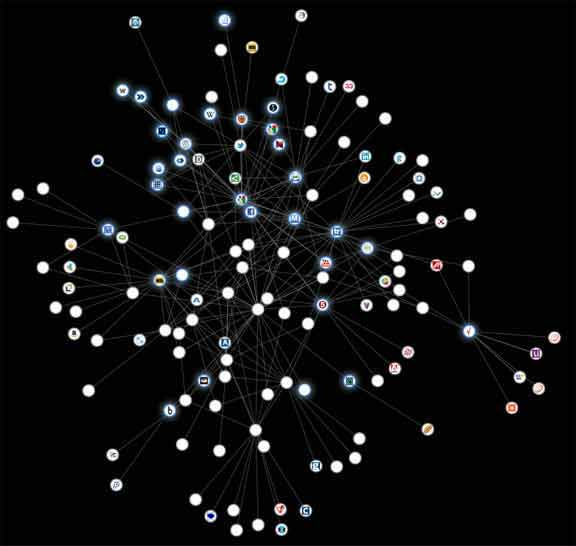

Having downsized my home a couple of times in the last year it is no understatement to say I have urgent space issues. I have power tools, large kitchen devices and surplus everything else. I looked online for a new shed, comparing reviews and investigating the UK's top shed building companies in my typically obsessive way. Having found "the one", I paid the company and am currently waiting for the timber that I will use to make the concrete base for the shed in preparation for delivery.

Imagine my irritation a few days after my investigations to discover that almost every web page I visit contains some kind of shed advert! It seems that the popular search engine that I use actually owns a large advertising and tracking company and that this company advertises on a very large percentage of websites. A lot has been said about online privacy and users rights to own their data but little has been said about what can be done about it.

It irks me that my search results have suddenly become shed based... wood, cedar, paint, tools internet and house are all terms that result in the first few results being related to sheds. Interestingly there is a "Why do I see this?" link next to these results and clicking this link provides an option not to receive these targeted results. Conveniently, if I attempt to opt out nothing changes and if I look at the option again it remains set for me to receive targeted results. I also find that the search results that I receive appear to be the results that the search company think that I want to receive.

I greatly dislike the fact that if you and I search for a particular term both us us will receive a completely different set of results. I would love to say that tracking a user in this way should be illegal but the truth is that online advertising is very big business and it won't be going away any time soon. A quick look at the profits of large search engine and social media companies shows just how lucrative online advertising can be. I have nothing against online advertising itself but I do have a problem with the methods that some websites and online stores employ in order to track my online activity.

Before the [recent(ish) media outrage](http://edition.cnn.com/2012/03/01/tech/social-media/twitter-selling-tweets/) would you ever have thought that Twitter would begin selling it's users tweets? Google’s mission is to organize the world’s information and make it universally accessible and useful. Lots of people I know find this a frightening concept. Need I mention Facebook and the many privacy issues that have been reported. Personally, I don't mind the idea of them using e.g. pictures that I have uploaded, after all, I did upload the picture to their servers. I really do dislike them using my data to target me with their adverts.

Tracking aside, there are bigger issues to worry about. Many web sites, in particularly forums, send usernames and passwords in plain text. When the data is sent over the internet it goes through a bunch of servers before it arrives at it's destination. It is simple to find the path that your data takes using traceroute:

```powershell
tracert google.com
Tracing route to google.com [173.194.34.72]
over a maximum of 30 hops:
1    <1 ms    <1 ms    <1 ms  my.router [192.168.1.1]
2    24 ms     4 ms     5 ms  93.186.155.65-ifnl.net [93.186.155.65]
3     5 ms     5 ms     5 ms  ge-2-0-0-xcr1.lsw.cw.net [194.112.69.129]
4     6 ms     4 ms     5 ms  xe-4-3-0-xcr1.lns.cw.net [195.2.28.42]
5    81 ms    85 ms    82 ms  72.14.198.113
6    36 ms     5 ms     6 ms  209.85.240.63
7     6 ms     5 ms     5 ms  209.85.253.31
8     5 ms     5 ms     5 ms  lhr14s19-in-f8.1e100.net [173.194.34.72]
```

All eight steps in this traceroute are points where a device could be intercepting your usernames and passwords and you would know nothing about it. One tool that helps protect against this kind of activity is the Secure Sockets Layer (SSL).

SSL provides a way to create an encrypted channel between an application running on your computer and an application running on another computer. When it comes to web pages then the secure protocol that we use is HTTPS. When you are on a webpage containing a log in dialog it is only safe to submit your username and password only if the page is an HTTPS page.

So, why don't we just use HTTPS all of the time, would that not solve all of our privacy issues? No, unfortunately not. HTTPS ensures that your data is safe between your computer and the destination server. Once your data is on the server it is in the hands of the organization that owns the server. This is highly likely to be a legitimate server but it could just as easily be an evil webmaster that is attempting to gather your personal information.

A useful Firefox extension that will use HTTPS versions of a site whenever available is [HTTPS Everywhere](https://www.eff.org/https-everywhere "HTTP Anywhere"). I would certainly suggest using it, after it is installed you will find that a large amount of sites will automatically run using HTTPS.

There is an excellent article that explains why you would would want to encrypt your internet traffic on Pixel Privacy's website [here](https://pixelprivacy.com/resources/how-to-encrypt-your-traffic/).

Another issue that plagues the internet today is website spoofing / phishing. Website spoofers create websites that looks very similar to a site that you commonly use with the soul purpose of gaining information about you. In the last couple of years sites that directly ask you for information such as bank or credit card details have become more popular. An example of this kind of site can be found [here](http://ismycreditcardstolen.com "Is my credit card stolen"). The page does not submit any information, in fact you don't really need to enter anything, it is designed as a teaching aid. Try it, you can trust it... honest (to be safe don't use your real information).

Compared to the illegal vulnerabilities that we face, tracking is not such a worry but more of an irritating abuse of privacy. Google, Facebook, Twitter and others make money by providing users with a free service in return for information about them. This information is either used by the sites themselves or sold to other sites in order to better target you with adverts that they believe that you will respond to. This video highlights this issue in quite an eye opening way:

`youtube: https://www.youtube.com/embed/yZKul_awxMA`

Google and Facebook have built relationships with millions of other websites to help them track your web activity using cookies. Google uses it's adverts, and analytical services to track what you do whilst Facebook uses it's log in services and like buttons. It is possible to disable cookies in your browser preferences but you would find that many sites would not work properly and you would have to log in every time you visit. Deleting cookies can help but some websites create zombie cookies (the word cookie here is misleading).

Zombie cookies are stored in multiple locations using multiple methods e.g. Flash LSOs, cookies, local storage, web databases etc. When a zombie cookie is erased it recreates itself along with it's gathered information when you return to a related website.

There is an excellent Firefox extension called [Lightbeam](https://addons.mozilla.org/firefox/addon/lightbeam/). Lightbeam allows you to see what kind of communications go on between the sites you visit. When the extension is installed click on the white circle at the bottom right of the browser to start. A tree similar to the one below will appear with each node representing a website or domain. The collusion developers are working on adding more features, such as the ability to click on any node in the graph and tell Firefox to block third-party cookies to that site. They are also working on visualizing other methods of tracking besides third-party cookies. If you would like to keep an eye on their progress, file a bug, request a feature, or get a copy of the source code, please go to [http://github.com/toolness/collusion](http://github.com/toolness/collusion).

<figure>



  <figcaption>The excellent Lightbeam extension</figcaption>
</figure>

Unfortunately, even when cookies are blocked there are things that websites can do in order to track you. Take for example a Facebook like button, even without cookies it would be capable of informing Facebook which website you were on when you clicked the button and which page referred you to that website. There is really very little, if anything, that you can do in order to prevent this.

Another technique that can be used to identify you is fingerprinting. This is a method of gathering information about your browser in an attempt to uniquely identify you. Although you may think your browser is not unique consider how unique your personal combination of screen size, color depth, time zone, user agent and browser plugins. You can check how unique your browser is [here](http://panopticlick.eff.org/ "How unique is your browser"), the odds are that you can be uniquely identified. This method could potentially be used to track you without using cookies but at the time of writing it is not commonly used.

I have always worried about my online privacy. In fact, it is because Mozilla is a non profit organization that I work for them. They are not an advertising company so I can be absolutely certain that my browser is not spying on me. Of course, tracking cookies are part of the web so we can't block them but we are actively working on ways to give you control of this area of the internet. Another video:

`youtube: https://www.youtube.com/embed/2J0ITwUZ4lc`

Cheesy maybe, but very educational.

Firefox contains "[Do not track](https://www.mozilla.org/dnt/)." Do Not Track is a feature in Firefox that allows you to let a website know you would like to opt-out of third-party tracking for purposes including behavioral advertising.&nbsp;Companies are starting to support Do Not Track, but you may not notice many changes until more tracking companies choose to honor it. Mozilla are actively working with companies that have started to implement Do Not Track and with others who have committed to doing so soon.
How do you enable "Do not track?" Simple, watch this video:

`youtube: https://www.youtube.com/embed/D0ieagw4jFI`

In fact, if you want to go all out against tracking and advertising you could also install these Firefox extensions:

- [HTTPS Everywhere](https://www.eff.org/https-everywhere) - As mentioned above, HTTPS Everywhere is a Firefox and Chrome extension that encrypts your communications with many major websites, making your browsing more secure. It is available for Firefox and Chrome bug due to a Chrome bug has far better stability in Firefox.
- [Adblock Plus](https://addons.mozilla.org/en-US/firefox/addon/adblock-plus/?src=cb-dl-users) - Annoyed by adverts? Troubled by tracking? Bothered by banners? Install Adblock Plus now to regain control of the internet and change the way that you view the web.
- [Better Privacy](https://addons.mozilla.org/en-US/firefox/addon/betterprivacy/?src=cb-dl-users) - Remove or manage a new and uncommon kind of cookies, better known as LSO's (mentioned above when talking about zombie cookies). The BetterPrivacy safeguard offers various ways to handle Flash-cookies set by Google, YouTube, Ebay and others ...
- [Ghostery](https://addons.mozilla.org/en-US/firefox/addon/ghostery/?src=cb-dl-users) - Ghostery sees the "invisible" web, detecting trackers, web bugs, pixels, and beacons placed on web pages by Facebook, Google Analytics, and over 1,000 other ad networks, behavioral data providers, web publishers - all companies interested in your activity.
- [Lightbeam](https://addons.mozilla.org/firefox/addon/lightbeam/) - As mentioned above, visualize who's tracking you in real time. To get started, click on the Collusion icon in the bottom-right corner of your browser. (You may need to show the Add-on Bar to see the icon).
- [NoScript](https://addons.mozilla.org/en-US/firefox/addon/noscript/) - NoScript allows you more control over JavaScript running in your browser. It allows granular control over which scripts you would like to allow to run on any page allowing you to e.g. block JavaScript from third party sites. It really is a very good extension, but it needs to be used with care as this extension is the most likely out of this list to break websites.
- [Cookie Monster](https://addons.mozilla.org/en-US/firefox/addon/cookie-monster/) - Provides an easy NoScript-style toolbar button for changing domain-specific cookie settings so you can default to forcing session cookies and easily allow them for just the domains where you want "Remember Me" to work.

In fact, there were 798 Firefox extensions related to Privacy &amp; Security at the time of writing, the four I have selected here are, in my opinion, the cream of the crop. Of course, you may have your own favorites... feel free to let us know.
