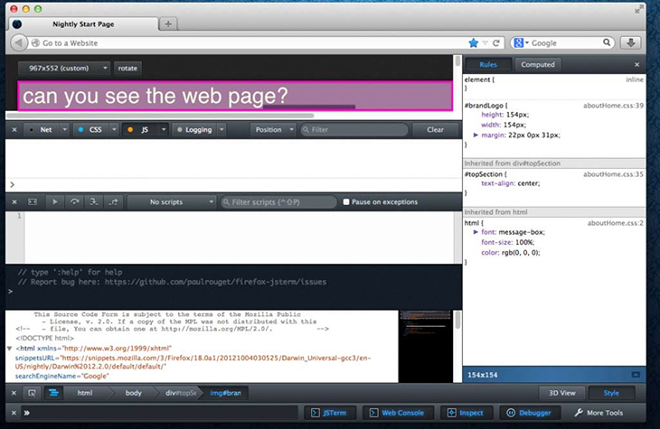
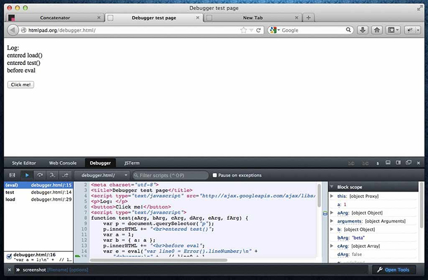
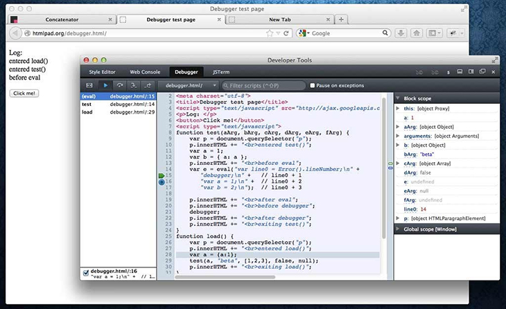

Hopefully, most of you are familiar with [Firefox Developer Tools](https://developer.mozilla.org/docs/Tools "Firefox Developer Tools") by now, if not then now is the time to get familiar!
The DevTools Team recently met up in London to talk about, and generally hack on, developer tools stuff and it turned out to be an amazingly productive time. The DevTools team has two branches, the debugger team and the inspector team so I will discuss them separately.

## The Debugger Team a.k.a. Team Minotaur

Rob Campbell talked about how to build a Jetpack addon using Scratchpad. They have managed to get [Firefox chrome debugging](https://blog.astithas.com/2012/10/debugging-firefox.html "Firefox chrome debugging") working... it is still work in progress but it will be extremely useful for debugging Firefox OS etc. Mihai Sucan managed to get the Web Console working to log errors, network requests etc from a [Gaia](https://wiki.mozilla.org/Gaia "Gaia") installation. They even managed to step through CoffeeScript using sourcemaps!

Not debugger related but also by a member of that team, Victor Porof demoed WebGL live shader editing using scratchpad.

## The Inspector Team a.k.a. Team Carnage [^1]

Paul Rouget really was on fire, he has managed to get the Responsive Design View to use mobile style scrollbars instead of the standard ones.

`youtube: https://www.youtube.com/embed/M2y5S7p81jU`

Paul has also managed to add a live preview to the DOM Tree à la Sublime Text and added an OSX fullscreen button to the scratchpad.

`youtube: https://www.youtube.com/embed/61tQij_ox9k`

Paul, Heather and myself managed to get a new panel management system working. These panels will be a little like Firebug panels on steroids and will ultimately make all of our lives much easier, more about that below.

## Others

Mark Goodwin has rewritten the [Command Line](https://developer.mozilla.org/docs/Tools/GCLI "The Firefox Command Line") cookie command so that it is much more reliable when creating and editing cookies. Kevin Dangoor added an in page HTML editor that can be used along with the DOM Tree for Dreamweaver-like editing.

## The DevTools API

Before I say anything about this API I would like to add that it is so early alpha that it is a long way away from being merged with Firefox's main branches. Everything here is subject to change so don't use it, at least no until we have everything working properly!
Paul Rouget has also blogged about the [DevTools Toolbox](https://paulrouget.com/e/devtools-toolbox/ "The DevTools Toolbox") in a little less detail. I stole the images on this page from him to save a little time... thanks Paul.

I mentioned earlier that we will be moving to panels similar to Firebug's. Of course, a lot of people like our sidebar so we didn't want to lose that. Unfortunately, if every tool was allowed to choose how and where it's panels are opened we very quickly have no space for the content area, we call this phenomena "The DevTools Donut."

<figure>



  <figcaption>Firefox developer tools donut</figcaption>
</figure>

We have also received complaints that opening a sidebar causes reflow and can make it impossible for pages that use media queries to be edited properly. Others do not like editing at the bottom of the screen like in Firebug because some tools are better off in a side panel.

The DevTools API allows a tool to register itself. On registration the tool will be passed an iframe in which it will be responsible for rendering itself. Of course, we will send events to the tool so that it can react as appropriate. This means that tools can forget about panels and leave all panel related activities to be handled by the panel manager.

Registering a tool is fairly simple:

```js
gDevTools.registerTool({
  id: "myToolId",
  killswitch: "devtools.mytool.enabled", // Your tool needs to create this
  icon: "chrome://browser/skin/devtools/mytool-tool-icon.png",
  url: "chrome://browser/content/devtools/mytool.xul",
  label: l10n.getStr("ToolboxMyTool.label"),
  build: function (aIFrameWindow, aTarget) {
    return new MyToolInstance(aIFrameWindow, aTarget);
  },
});
```

MyToolInstance needs to have a build method that accepts two arguments, an iframe.contentWindow and a target. The window is the window in which your tool is to build itself and the target is an object that specifies a gDevTools.TargetType and a value such as a tab. It also needs a destroy method so that it can clean up listeners etc. when the toolbox is closed.

The tools open in what we call the Toolbox. This toolbox appears at the bottom of the content area by default but can also be moved to the right of the content area or popped out. Tools will keep their state when changing tabs so you do not usually need any special mechanism to save and restore state.

<figure>



  <figcaption>Toolbox displayed below content</figcaption>
</figure>

<figure>


  <figcaption>Toolbox displayed on the right of content</figcaption>
</figure>

<figure>



  <figcaption>Toolbox undocked</figcaption>
</figure>

Tools do not need to live in a panel. We also have a mechanism that allows you to register a Firefox Command Line command and display it as a button. This makes it extremely easy to add buttons to create screenshots, trigger responsive design mode, restart Firefox etc.

Are we missing anything? I don't think so but if we are then feel free to let us know.

### Resources

[^1]: I can neither confirm or deny that "Team Carnage" is the inspector team's official name although we may or may not be searching for one. If you can think of a better name then please let us know.
