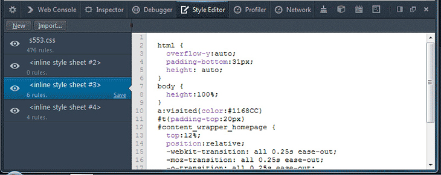
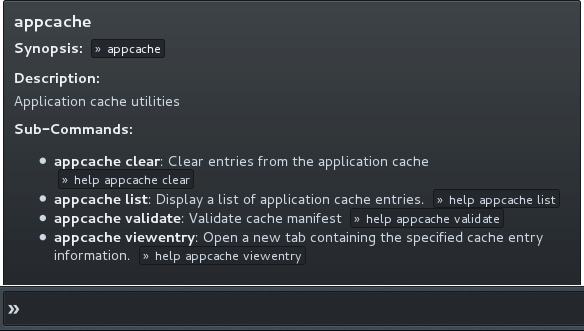
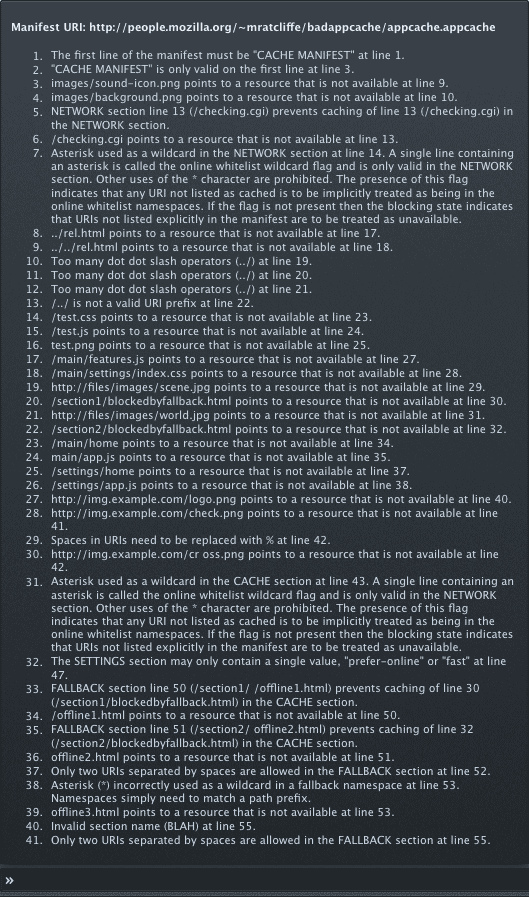

If you have ever used the application cache you will probably be familiar with how easy it is to break offline functionality and how difficult it is to work out why things are broken. With a large offline web app finding the source of problems can be an almost insurmountable task.

I guess that what I am saying is that [the application cache is a douchebag](https://alistapart.com/article/application-cache-is-a-douchebag). I completely understand that if there is an error in your application's manifest you probably don't want your users to be confronted with a bunch of error messages but something needs to be done.

Because displaying a bunch of errors about a broken cache manifest is probably undesirable we have decided to create a developer tool that lets you know if you have a problem with your manifest. The main problem we have is that the Toolbox is already becoming crowded and we are just getting started.

<figure>

  <figcaption>Firefox developer tools toolbox</figcaption>
</figure>

In order to avoid cluttering the Toolbox we have used the Firefox Command Line. The command line is a place where we can add as many tools as we like without cluttering the interface. To open the Developer Toolbar press <kbd>shift</kbd> + <kbd>f2</kbd> or select <kbd>Developer Toolbar</kbd> from the web developer menu.

The appcache commands are available in [Firefox Nightly](https://nightly.mozilla.org/)

To list available appcache commands type "help appcache" in the developer toolbar.

<figure>

  <figcaption>Output from the help appcache command</figcaption>
</figure>

The currently available appcache commands are:

`appcache clear` clears all appcache entries.

`appcache list [searchterm]` lists all appcache entries containing an optional search term

<figure>

  <figcaption>Output from the appcache list command</figcaption>
</figure>

`appcache viewentry` shows the about:cache-entry page for the current cache entry.

Note: appcache viewentry will not give you any information until [bug 861866](https://bugzilla.mozilla.org/show_bug.cgi?id=861866) is fixed.

`appcache validate [URI]` is by far the most useful of the appcache commands. If a URI is specified then the cache manifest for that page will be validated. As many of you know, there are a lot of things that could invalidate a manifest but this command will uncover most of them.

<figure>

  <figcaption>Output of the appcache validate command</figcaption>
</figure>

If you find any situations where an application cache is invalid and our tool does not pick up the problem then please [let us know](https://bugzilla.mozilla.org/enter_bug.cgi?alias=&assigned_to=nobody%40mozilla.org&attach_text=&blocked=&bug_file_loc=http%3A%2F%2F&bug_severity=normal&bug_status=NEW&cf_blocking_b2g=---&cf_crash_signature=&cf_status_b2g18=---&cf_status_b2g18_1_0_0=---&cf_status_b2g18_1_0_1=---&cf_status_firefox20=---&cf_status_firefox21=---&cf_status_firefox22=---&cf_status_firefox23=---&cf_status_firefox_esr17=---&cf_tracking_b2g18=---&cf_tracking_firefox20=---&cf_tracking_firefox21=---&cf_tracking_firefox22=---&cf_tracking_firefox23=---&cf_tracking_firefox_esr17=---&cf_tracking_firefox_relnote=---&cf_tracking_relnote_b2g=---&comment=&component=Developer%20Tools%3A%20Graphic%20Commandline%20and%20Toolbar&contenttypeentry=&contenttypemethod=autodetect&contenttypeselection=text%2Fplain&data=&defined_groups=1&dependson=&description=&flag_type-203=X&flag_type-37=X&flag_type-41=X&flag_type-5=X&flag_type-607=X&flag_type-720=X&flag_type-721=X&flag_type-737=X&flag_type-748=X&flag_type-781=X&flag_type-787=X&flag_type-791=X&flag_type-799=X&flag_type-800=X&flag_type-802=X&flag_type-809=X&form_name=enter_bug&keywords=&maketemplate=Remember%20values%20as%20bookmarkable%20template&op_sys=All&priority=--&product=Firefox&qa_contact=&rep_platform=All&requestee_type-203=&requestee_type-41=&requestee_type-5=&requestee_type-607=&requestee_type-748=&requestee_type-781=&requestee_type-787=&requestee_type-791=&requestee_type-800=&short_desc=&status_whiteboard=&target_milestone=---&version=unspecified). In fact, if you have an idea for a new appcache command then please [tell us](https://bugzilla.mozilla.org/enter_bug.cgi?alias=&assigned_to=nobody%40mozilla.org&attach_text=&blocked=&bug_file_loc=http%3A%2F%2F&bug_severity=enhancement&bug_status=NEW&cf_blocking_b2g=---&cf_crash_signature=&cf_status_b2g18=---&cf_status_b2g18_1_0_0=---&cf_status_b2g18_1_0_1=---&cf_status_firefox20=---&cf_status_firefox21=---&cf_status_firefox22=---&cf_status_firefox23=---&cf_status_firefox_esr17=---&cf_tracking_b2g18=---&cf_tracking_firefox20=---&cf_tracking_firefox21=---&cf_tracking_firefox22=---&cf_tracking_firefox23=---&cf_tracking_firefox_esr17=---&cf_tracking_firefox_relnote=---&cf_tracking_relnote_b2g=---&comment=&component=Developer%20Tools%3A%20Graphic%20Commandline%20and%20Toolbar&contenttypeentry=&contenttypemethod=autodetect&contenttypeselection=text%2Fplain&data=&defined_groups=1&dependson=&description=&flag_type-203=X&flag_type-37=X&flag_type-41=X&flag_type-5=X&flag_type-607=X&flag_type-720=X&flag_type-721=X&flag_type-737=X&flag_type-748=X&flag_type-781=X&flag_type-787=X&flag_type-791=X&flag_type-799=X&flag_type-800=X&flag_type-802=X&flag_type-809=X&form_name=enter_bug&keywords=&maketemplate=Remember%20values%20as%20bookmarkable%20template&op_sys=All&priority=--&product=Firefox&qa_contact=&rep_platform=All&requestee_type-203=&requestee_type-41=&requestee_type-5=&requestee_type-607=&requestee_type-748=&requestee_type-781=&requestee_type-787=&requestee_type-791=&requestee_type-800=&short_desc=&status_whiteboard=&target_milestone=---&version=unspecified).
