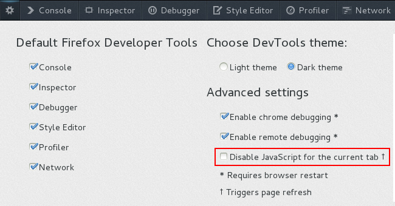

At the beginning of April [Alex Limi](https://limi.net/) decided that we should [remove the Enable JavaScript checkbox](https://bugzilla.mozilla.org/show_bug.cgi?id=851702) from Firefox's preferences dialog. His reasoning was that clearing that checkbox breaks a huge amount of websites and therefore breaks the web.

Alex was completely correct and I wholeheartedly agree with the removal of this option but if you look at the bug's comments you will see that a bunch of people are not so happy with this decision. Well, we have news for you. We have just landed a change that [adds a tab specific version of this option](https://bugzilla.mozilla.org/show_bug.cgi?id=864249) to the Firefox Developer Tools preferences panel.

<figure>

  <figcaption>Disable javascript option in firefox devtools</figcaption>
</figure>

If you check the box then the page will refresh and, from that point on, everything that you open in that tab will have JavaScript disabled. Making this setting per tab makes sense because the developer toolbox has one instance per tab. Closing either the toolbox or the tab enables JavaScript again.
