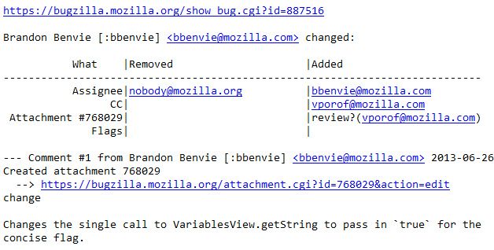
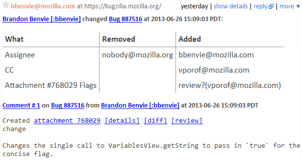

Even after a few years working for Mozilla I still occasionally come across a Bugzilla tip that I don't know about. This post is a attempt to gather Bugzilla tips from around the Internet whilst adding a few of my own to the list.

To start, if you’ve never used Bugzilla before (or even if you have), you should watch a video [johnath](https://twitter.com/johnath) made called "Bugzilla for Humans." It gives a really nice overview of key Bugzilla features, as well as tips for more advanced users:

`youtube: https://www.youtube.com/embed/piT1pflOTDs`

## Quicksearch, I'll Race Ya!

The most useful tip I know of is to set up a keyword search for the quicksearch box. Open [https://bugzilla.mozilla.org/](https://bugzilla.mozilla.org/) and right-click the quicksearch box near the top of the page. Select "Add a keyword for this search&hellip;" and in the keyword field type "bug." You can now search bugzilla using queries like this directly from your Firefox Awesome Bar:

`bug 50000` opens bug 50000.

Or even:
`bug WONTFIX Inspector` open bugs containing "Inspector" and marked as WONTFIX.

Two lists of quicksearch fields are available. A simplified list can be found [here](http://www.squarefree.com/bugzilla/quicksearch-help.html) and a more complete list can be found [here](https://bugzilla.mozilla.org/page.cgi?id=quicksearch.html).

[Mike Beltzner](http://twitter.com/beltzner) created an excellent video explaining some of the ways this feature can be used:

`youtube: https://www.youtube.com/embed/14W-XguG--U`

## Watching a Component or a Developer

If you find yourself interested in a certain area of the Mozilla project e.g. Firefox::Developer Tools, you can opt to [watch its Bugzilla component](https://bugzilla.mozilla.org/userprefs.cgi?tab=component_watch). You can also [watch certain users](https://bugzilla.mozilla.org/userprefs.cgi?tab=email), which is a really neat feature if you’re a new contributor looking to follow the activity of a more experienced developer.

## Autolinkification

Bugzilla comments are plain text - so typing &lt;U&gt; will produce less-than, U, greater-than rather than underlined text. However, Bugzilla will automatically make hyperlinks out of certain sorts of text in comments. For example, the text "http://www.bugzilla.org" will be turned into a link: http://www.bugzilla.org. Other strings which get linkified in the obvious manner are:

1. bug 12345
2. comment 7
3. bug 23456, comment 53
4. attachment 4321
5. mailto:george@example.com
6. george@example.com
7. ftp://ftp.mozilla.org
8. Most other sorts of URL

A corollary here is that if you type a bug number in a comment, you should put the word "bug" before it, so it gets autolinkified for the convenience of others.

## Use Needinfo

There is a flag for all bugs in Bugzilla called the needinfo flag which should be used if you need information from someone. So if you are asking someone a question, then needinfo them!

## Is your Bugzilla Butt-Ugly?

You are probably still using the default theme. This can be easily remedied:

- Click <kbd>Preferencies</kbd> &rarr; <kbd>General Preferences</kbd>.
- Under <kbd>Bugzilla's general appearance (skin)</kbd> select <kbd>Mozilla</kbd>

Now your Bugzilla looks [sexy and you know it](http://www.youtube.com/watch?v=R2iOCHhJVhE)!

## Does your Bugmail make your Eyes Bleed?

Well, you probably have Bugzilla set up to use the default email format (text):

<figure>

  <figcaption>Bugzilla plain text email</figcaption>
</figure>

Switching this to HTML format makes them 1000 times easier to read, especially on a phone. Don't look for it under the "Email Preferences" tab though, that would be way too easy.

- Click <kbd>Preferencies</kbd> &rarr; <kbd>General Preferences</kbd>.
- Under <kbd>Preferred email format</kbd> select <kbd>HTML</kbd>.

<figure>

  <figcaption>Bugzilla HTML email</figcaption>
</figure>

## Bugzilla Extensions to Rock your World

There are a few great extensions available that make Bugzilla a more pleasurable experience. Here are some of my favorites:

1. [BugzillaJS](https://addons.mozilla.org/firefox/addon/bugzillajs/): Created by [Gregory Koberger](https://twitter.com/gkoberger) and [Anthony Ricaud](https://twitter.com/rik24d). This extension adds keyboard shortcuts, quick file box, inline image / github previews, relative timestamps, Gravatars and more. More information about features is available on the extensions AMO page. This extension contains almost all of Bugzilla Tweak's features and more. You can contribute to the addon [here](https://github.com/gkoberger/BugzillaJS)
2. [Bugzilla Tweaks](https://addons.mozilla.org/firefox/addon/bugzilla-tweaks/): Created by [Ehsan Akhgari](https://twitter.com/ehsanakhgari), Dave Lawrence and [Byron Jones](https://twitter.com/globau). This extension adds a bunch of features that do not appear to be documented anywhere. These are features such as adding "Copy Check-in Comment" to the context menu. If anybody knows how to contribute to this extension then please let me know.
3. [Github tweaks for Bugzilla](https://addons.mozilla.org/firefox/addon/github-tweaks-for-bugzilla/): Created by [Dietrich Ayala](https://twitter.com/dietrich). This extension allows for better Github and Bugzilla integration. On a pull-request page, it adds a new button for submitting the pull-request as an attachment to a bug in bugzilla.mozilla.org. The bug id can be specified by starting your pull request title with "bug ######". Your Bugzilla credentials are pulled out of Firefox's password manager. You can contribute to this extension [here](https://github.com/autonome/Github-Bugzilla-Tweaks).
4. [Bugzilla TODOs](http://harthur.github.io/bugzilla-todos/): This is not an extension but a really useful live dashboard created by [Heather Arthur](https://twitter.com/harthvader). It contains five tabs (To Review, To Check In, To Nag, To Fix and To Respond) and, because it is live, it is updated automagically. I keep this open as a pinned tab so that I can instantly (via the favicon) see if somebody wants something from me. You can contribute to this handy little web app [here](https://github.com/harthur/bugzilla-todos).

## Attachments

Use attachments, rather than comments, for large chunks of ASCII data, such as trace, debugging output files, or log files. That way, it doesn't bloat the bug for everyone who wants to read it, and cause people to receive fat, useless mails.

Trim screenshots. There's no need to show the whole screen if you are pointing out a single-pixel problem.

Don't attach simple test cases (e.g. one HTML file, one CSS file and an image) as a ZIP file. Instead, upload them in reverse order and edit the referring file so that they point to the attached files. This way, the test case works immediately out of the bug.

Bugzilla stores and uses a Content-Type for each attachment (e.g. text/html). To download an attachment as a different Content-Type (e.g. application/xhtml+xml), you can override this using a 'content-type' parameter on the URL e.g. `&content-type=text/plain.`

## Etiquette

If you are changing the fields on a bug, only comment if either you have something pertinent to say, or Bugzilla requires it. Otherwise, you may spam people unnecessarily with bug mail. To take an example: a user can set up their account to filter out messages where someone just adds themselves to the CC field of a bug (which happens a lot.) If you come along, add yourself to the CC field, and add a comment saying "Adding self to CC", then that person gets a pointless piece of mail they would otherwise have avoided.

Don't use sigs in comments. Signing your name ("Bill") is acceptable, if you do it out of habit, but full mail/news-style four line ASCII art creations are not.

You should also read [Bugzilla’s etiquette guidelines](https://bugzilla.mozilla.org/page.cgi?id=etiquette.html) to learn what behaviors are acceptable for Bugzilla users. In general, just be a nice person and everyone will be happy!

## Credits

Some of this information was collected from other websites so it is only fair that I give credit where credit is due:

- [Margaret Leibovic's Bugzilla 101](http://blog.margaretleibovic.com/post/36893756730/bugzilla-101)
- [Johnath's Bugzilla for Humans](http://blog.johnath.com/2010/02/04/bugzilla-for-humans/)
- [Bugzilla Tips Wordpress Blog](http://bugzillatips.wordpress.com/)
- [Jesse Ruderman's Quicksearch Tips](http://www.squarefree.com/bugzilla/quicksearch-help.html)
- [Bugzilla Quicksearch](https://bugzilla.mozilla.org/page.cgi?id=quicksearch.html)
- [The Bugzilla Guide - Hints and Tips](http://www.bugzilla.org/docs/2.18/html/hintsandtips.html)

If the comments section below has not loaded below then you probably need to update your browser.
