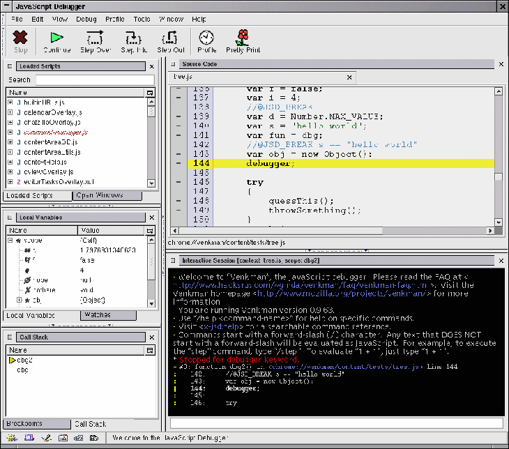
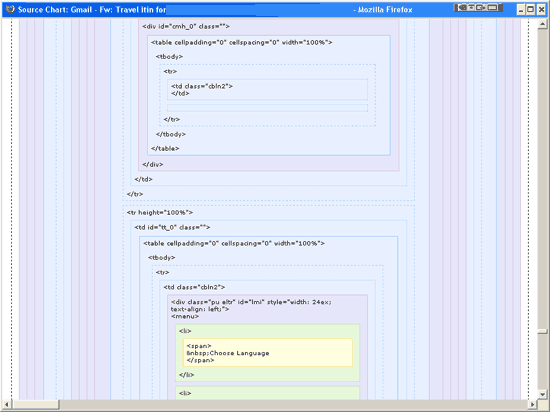
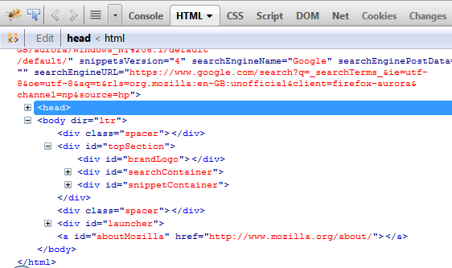
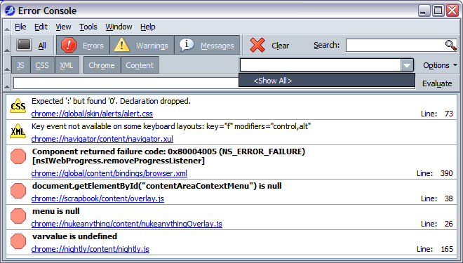
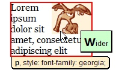
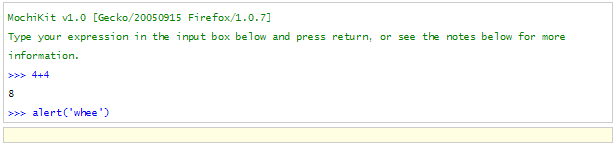
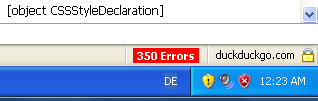

When Joe Hewitt was seven years old his father wanted to become a computer programmer so he bought an IBM PCjr. Joe would often watch his father typing in programs from PC Magazine. He started learning himself and when he got older he just sort of took off on his own.

The first programming project that he remembers working on was when he was in fifth grade (ten – eleven years old). He made an animated ASCII art of a rocket ship blasting off. He also wrote a game show in "Cartridge Basic" (an enhanced version of BASIC for the IBM PCjr).

As far as education goes, he started as a computer science major before deciding that he didn't like the formal computer science stuff and switched to graphic design. He then realized that he was not an artist and moved back to computer science. Whilst he was still at college he received a ton of job offers in the field, dropped out of college and has been professional ever since.

Around 1999 he was working as a web developer and began to gain an interest in Mozilla. He followed the project mostly from the standpoint of a web developer wanting to see what this new browser was going to turn into. Eventually he learned about XUL, became fascinated with it and started looking for ways to get involved.

Luckily, before he even really started contributing, a job opened up with Netscape and he was hired to work on the Netscape user interface (CSS, JavaScript and XUL).

After a few years at Netscape Joe, Dave Hyatt, Chanial and Blake Ross started working on a streamlined version of the Mozilla browser that was called Phoenix, Firebird and eventually Firefox.

Because of the structure of Mozilla the developers were free to work on the things that were of interest to them. During his time there he created the DOM Inspector and worked for a few years on the browser side of things.

After his time with Mozilla he started work as a web developer again and soon found that the state of the art tools that he had used as a web developer in the late 90s had not changed. The standard way to debug a web application was using alert dialogs but this was very inefficient and limiting. Joe thought that maybe allowing people to log information to a simple panel could be useful. This is when the birth of modern web developer tools truly began.

Joe says that features that you see in Firebug today were inspired by the Venkman JavaScript Debugger, View Rendered Source Chart, Console2, Aardvark, and MochiKit JavaScript Interpreter. Let's take a look at these tools and see how the functionality were absorbed into Firebug.

## Venkman JavaScript Debugger

A lot of developers are surprised to hear that Firebug is not the first JavaScript debugger for Firefox. Venkman JavaScript Debugger was, until mid 2011, commonly used to debug JavaScript in web pages and extensions.

<figure>

  <figcaption>Venkman debugger</figcaption>
</figure>

Venkman contained a very powerful feature set that made for an excellent debugger. These included:

- Stop
- Continue
- Step over
- Step into
- Step out
- JavaScript profiler
- Save profile data
- Pretty print
- Save and restore breakpoints and watches
- Break on errors
- Ignore errors
- Break on exceptions
- Ignore exceptions
- Function name guessing
- Locals
- Watches
- Breakpoints
- Call stack

As this is just a quick tour of the extensions that have inspired Web Developer Tools we will not go into any more detail about Venkman here. If you would like to learn more about it then take a look at the [Venkman page](https://developer.mozilla.org/docs/Venkman) on MDC.

Venkman was the inspiration for the JavaScript Debugger used in Firebug.

## View Source Chart

This extension shows the browsers interpretation of a web page. It shows the source in a hierarchical view, grouping elements at the same level and graphically displaying HTML tag boundaries.

<figure>

  <figcaption>View Source Chart</figcaption>
</figure>

This was the inspiration for Firebug's HTML panel … the comparison is clear when both tools are compared, especially in early Firebug versions. The formatting is fairly similar except that Firebug has a number of improvements such as expandable and collapsible HTML nodes, improved indentation and live editing. In its time, view rendered source was a very useful way to view the structure of an HTML page and is still preferred by some developers.

<figure>

  <figcaption>Firebug HTML Tree</figcaption>
</figure>

## Console2

<figure>

  <figcaption>Console2</figcaption>
</figure>

Console2, pronounced Console Squared or Console Two, replaced the JavaScript Console with what was a revolutionary Error Console.

This extension made it much simpler to find the cause of JavaScript errors by showing the line number and, eventually, allowing you to link to this line in the source. This method is all that is required to find syntax errors but is not so useful when it comes to finding logic errors. Still, this extension saved developers many, many hours when debugging JavaScript.

This extension was the inspiration for the error reporting in Firebug's Console Panel.

## Aardvark

Aardvark was another excellent extension and also the inspiration for Firebug's Inspector. By moving the mouse over elements on the screen you could view simple DOM properties like tag name, class and id.

<figure>

  <figcaption>Aardvark</figcaption>
</figure>

Sometimes the simplest ideas are the best and the concept of the inspector (highlighter) quickly became one of the core features of Firebug as it made it possible for people to select HTML elements as targets for each of Firebug's panels.

## MochiKit JavaScript Interpreter

[MochiKit](http://mochi.github.com/mochikit/) is a lightweight JavaScript library written and maintained by Bob Ippolito. It is Inspired by the Python networking framework and Twisted. It uses the concept of deferred execution to allow asynchronous behavior. This has made it very useful in the development of AJAX applications.

Of particular note is its ability to load and manipulate JSON-encoded data sets, and MochiKit.DOM, a set of functions to easily create dynamic page components.

MochiKit forms the foundation of the client-side functionality of the TurboGears Python web-application stack. Perhaps as a result of the author's involvement in the Python community, MochiKit exhibits many idioms familiar to Python programmers, and is commonly used in Python-based web applications.

The JavaScript Interpreter allows you to run JavaScript commands a line at a time and view the results in a div. Using this command line it is possible to quickly view the values of DOM properties, change the value of variables or call a pages functions. This was Joe Hewitt's inspiration for Firebug's JavaScript Interpreter (part of the JavaScript Console).

<figure>

  <figcaption>Mochikit JavaScript interpreter</figcaption>
</figure>

## Firebug Through the Ages

Although all of the applications we have discussed so far in this chapter were inspiration for some of Firebug's features, this does not mean that they were simply merged together and Firebug was complete. Firebug, like most applications was very simple and has gradually evolved into the fantastic tool that it is now.

## Version 0.2

`youtube: https://www.youtube.com/embed/JVCioNT-SYE`

The first publicly available release of Firebug was version 0.2. Although this was the first released version of Firebug it contained some very useful features even though there was only a single panel. In this version of Firebug there is only one panel, which is roughly equivalent to the console panel. AJAX logging was present even in this version.

The printfire function was the standard way to output messages. Inspected elements were logged to the panel with four tabs on the right hand side. Clicking these tabs expanded the panel's representation of the element, which consisted of:

- The XML tab shows the element in HTML view
- The CSS tab shows the elements CSS styles
- The Box tab shows the selected elements classic box model property values
- The JS tab shows the JavaScript properties of the selected element

Whenever there were JavaScript errors the status bar indicator would display the number of errors. Clicking on this status bar indicator would open Firebug.

<figure>

  <figcaption>Firebug 0.2 status bar indicator</figcaption>
</figure>

## Version 0.3

Version 0.3 introduced major changes to the way that Firebug worked, particularly the way that the inspector worked. Firebug now had two main tabs, a console tab to display messages and an inspector tab that allowed you to view the element. There was also a new search box that allowed you to search for tabs in the HTML Tree. The Inspector tab had five other tabs:.

- Source: The HTML tree. This panel has been largely unchanged from this version onwards.
- Style: A few computed styles.
- Layout: Basic layout information.
- Events: Any events raised triggered on the currently selected element.
- DOM: JavaScript object view of the currently selected node.

`youtube: https://www.youtube.com/embed/HBHkanS1euM`

## Version 0.4

Version 0.4 was the first version to feature the Debugger tab (figure 2.7.7.1).

- Stack traces were now displayed along with error messages.
- console.log('message'), console.warn('message'), console.info('message') etc. replaced printfire and were made available to all web pages.
- In the DOM tab arrays were now expandable and functions could be expanded to show their source.

Obviously, the inclusion of the JavaScript debugger was a major step forwards in Firebug's evolutionary trail. The whole idea of debugging JavaScript in the browser itself was something we had been waiting a long time for. Great job Joe!

`youtube: https://www.youtube.com/embed/LvdcAm1-4zU`

## Version 1.0

After version 0.4.1 Joe realized that people were depending on Firebug for their jobs and decided to have one person work on it full time. Version 1.0 represented a complete redesign of the Firebug user interface from the ground up. A bunch of new features were also released with this version, Joe lists them as:

- CSS editing
- Network load timing
- Box model visualization
- JavaScript profiling
- Command line autocomplete
- HTML change highlighting
- Debugger watchlists
- DOM editing
- Separate window support
- Per-site blacklists

`youtube: https://www.youtube.com/embed/Ks_Pp2jghVY`

At this point Joe was spending a lot of time on Firebug and was considering making it a paid product ($15 - $25) so that he could employ a couple of full-time engineers. Needless to say, this was a final option and never happened.

Although there has been lots of work done on Firebug since version 1.0 most of it has been bugfixes and minor features. Some major changes have crept in though, including:

- Console tab: Break on all errors.
- HTML tab: Break on HTML mutation.
- DOM tab: Break on property change.
- Net tab: Break on XHR.
- Persist button on all tabs.
- Switch color types.
- Restartless install
- Tabs on the top
- Navigation history
- Break on next
- Cookie tab
- Command line popup
- Command line history
- New side panels (e.g. selectors)
- List of tabs in the toolbar
- Tab options

Joe Hewitt talks about these things in his blog post [Firebug: A Love Story](http://joehewitt.com/2006/03/15/firebug-a-love-story).
