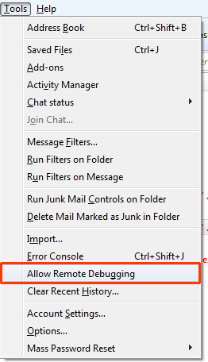
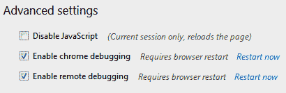
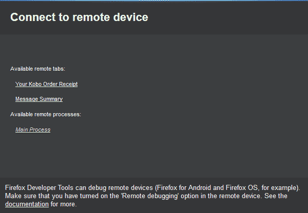

I recently discovered that it is possible to use [Firefox Developer Tools](https://developer.mozilla.org/docs/Tools) with [Thunderbird](https://www.mozilla.org/thunderbird/). [Philipp Kewisch](https://twitter.com/pkewisch) has done a fantastic job of his Google Summer of Code 2013 Project to bring Firefox Developer Tools to Thunderbird.

Starting with Thunderbird 24.0a1 and a matching version of [Firefox](https://www.mozilla.org/firefox/fx/#desktop), it is possible to debug Thunderbird code using Firefox Developer Tools. If your version of Thunderbird is 14.x then please go to <kbd>Help</kbd> &rarr; <kbd>About Thunderbird</kbd> and allow it to update.

For best results you should use the latest nightly versions of both Thunderbird and Firefox. At the very least the version numbers should match. Here is how to get things up and running using the latest nightlies:

- Download the latest [Thunderbird Nightly](https://ftp.mozilla.org/pub/mozilla.org/thunderbird/nightly/latest-comm-central/).
- Start Thunderbird.
- Select <kbd>Tools</kbd> &rarr; <kbd>Allow Remote Debugging</kbd>.

<figure>

  <figcaption>Thunderbird allow remote debugging</figcaption>
</figure>

- Download the same version of [Firefox Nightly](https://ftp.mozilla.org/pub/mozilla.org/firefox/nightly/latest-trunk/) as you did Thunderbird.
- Start Firefox.
- Press <kbd>Ctrl</kbd> &rarr; <kbd>Shift</kbd> &rarr; <kbd>K</kbd> to open the toolbox.
- Click <kbd>&#9881;</kbd> to open the developer tools options panel.
- Check <kbd>Enable Chrome Debugging</kbd> and <kbd>Enable Remote Debugging</kbd> then click <kbd>Restart Now</kbd> if it appears.

  <figure>

  

    <figcaption>Enable chrome debugging and enable remote debugging options</figcaption>
  </figure>

- Select <kbd>Web Developer</kbd> &rarr; <kbd>Connect…</kbd>
- Choose localhost port 6000 and click "Connect."

You will be presented with a set of available remote tabs and processes. For me they appeared as follows:

<figure>

  <figcaption>Available remote tabs and processes</figcaption>
</figure>

- "Your Kobo Order Receipt" - the area in which the selected email is displayed. In this view the following did / did not work:
  - The console tab may work but was empty when I tested.
  - The inspector, debugger, style editor and profiler work just fine.
  - The network tab was empty.
- "Message Summary" is the area in which email summaries are displayed when multiple messages are selected.
  - The console tab may work but was empty when I tested.
  - The inspector, debugger, style editor and profiler work just fine.
  - The network tab was empty.
- "Main Process" - the main Thunderbird process. In this view the following did / did not work:
  - The console, debugger and profiler work fine.
  - The inspector and style editor and network tabs were empty.

Although not all of the tools work perfectly in all contexts at least you can now use the DevTools for extension development and to fix bugs.

Philipp has the same code packaged as an extension that could be used to enable the debug server from other XUL apps [here](https://addons.mozilla.org/en-US/thunderbird/addon/remote-developer-tools-server/).

Something has been needed since Venkman development halted so now we have something there is no excuse, whether it is Thunderbird itself or an extension... go, get hacking!
