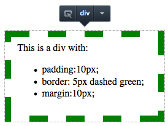
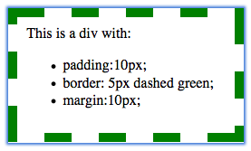
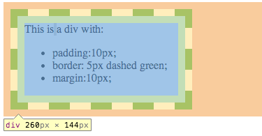
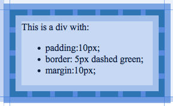
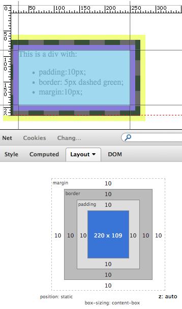
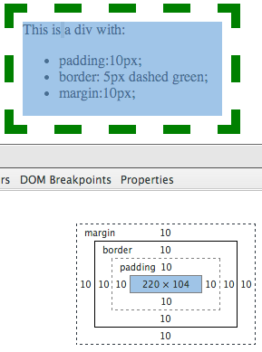
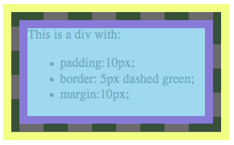

When it comes to the Firefox Developer Tools Inspector one of our most common requests is that our highlighter should support box model highlighting. We are working on implementing this but before we get into full swing we need to know exactly what you want it to look like and how you would like it to act.

Please take a look at how current tools behave and let us know what you would like our box model highlighting to look and behave.

The examples on this page show the different methods of inspecting this div in Firefox Developer Tools, Firebug, Chrome DevTools and Opera Dragonfly:

  

    This is a div with:  

- padding: 10px;
- border: 10px dashed green;
- margin: 10px;

  

## Inspection by mousing over content

This is the mode that most people are familiar with. You click the inspect button and move the mouse over the content area to highlight a node.

Firefox Developer Tools use a subtle outline around the border of the hovered element. In addition, a node infobar appears. This infobar allows you to set pseudoclasses such as :hover, delete the node, copy HTML etc. This is currently the only highlight mode used by the tools:

<figure>

  <figcaption>Mouse inspection Firefox</figcaption>
</figure>

Firebug uses a blue outline:

<figure>

  <figcaption>Mouse inspection Firebug</figcaption>
</figure>

Chrome DevTools highlights content, padding, border and margin areas even when inspecting via the mouse. They also display simple node information e.g. node name, width and height:

<figure>

  <figcaption>Mouse inspection Chrome</figcaption>
</figure>

Opera Dragonfly also highlights content, padding, border and margin areas even when inspecting via the mouse. In addition it shows guides outlining the border of the element:

<figure>

  <figcaption>Mouse Inspection Opera</figcaption>
</figure>

## Inspection by mousing over the layout (box model) panel

Firebug brings out the big guns here and highlights all of the different layout components. It also outlines the node's active container in a dashed red line and adds rulers to it (useful for absolutely positioned elements). In case this is not enough it adds guides around the section being hovered (content, border etc.):

<figure>

  <figcaption>Box model content hover Firebug</figcaption>
</figure>

Chrome DevTools highlights only the content, padding, border or margin depending on which is being hovered:

<figure>

  <figcaption>Box model content hover Chrome</figcaption>
</figure>

## Inspection by mousing over the nodes in the Markup (HTML) panel

Firebug shows the box model (content, padding, border and margin):

<figure>

  <figcaption>HTML Panel node hover Firebug</figcaption>
</figure>

Chrome DevTools and Opera Dragonfly act exactly the same as when mousing over content.

So the question is what would you like the Firefox Developer Tools highlighter to look like and how should it act in each of the situations above. It doesn't need to act like any other highlighter so be creative!
