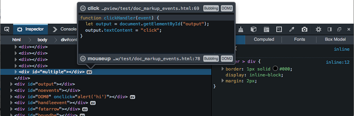

I recently realized that support for inspection of DOM events is very poor in pretty much all developer tools. Having seen Opera Dragonflies implementation some time ago I liked the way you could very easily see the scope of an event.

I have used a similar design to add DOM event inspection to Firefox Developer Tools. The event icons are visible in the markup view and if you click on them you can see information about the event including it's handler. If you click the debugger icon at the top left of the popup it will take you to that handler in the debugger.

<figure>

  <figcaption>Visual Events in Firefox developer tools</figcaption>
</figure>

Whilst developing this feature I noticed that my workflow changed considerably. I found myself repeatedly looking at the event handlers attached to e.g. a button, clicking the debug icon, adding a breakpoint and clicking the button.

We hope this feature will be useful to you. If you have any idea how we can improve this feature then please let us know via [our feedback channel](http://ffdevtools.uservoice.com/forums/246087-firefox-developer-tools-ideas) or [Bugzilla](https://bugzilla.mozilla.org/enter_bug.cgi?component=Developer%20Tools%3A%20Inspector&product=Firefox&rep_platform=All&op_sys=All).
