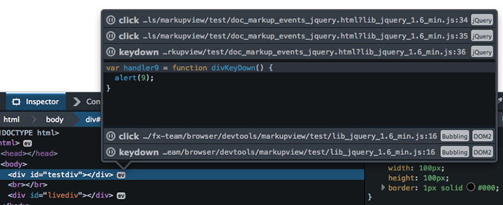

A little while back we [landed a feature](/view-dom-events-in-firefox-developer-tools/) that made it possible to interact with events from the markup panel of Firefox developer tools.

A lot of people were excited about this but we soon realized that jQuery wraps event handlers in a proxy making all handlers look like this:

```js
function() {
  return fn.apply( thisObject || this, arguments );
};
```

Numerous facepalms later and we now have support for jQuery and jQuery Live events. This support will be available in [tonight's nightly](https://nightly.mozilla.org/):

<figure>



  <figcaption>jQuery and jQuery Live Events</figcaption>
</figure>

Because library support is important we have created an API that allows developers and library authors to create "event parsers" that allow our tools to make sense of their event systems.

This API is priviledged code so to create an event parser you will need to create a simple Firefox extension.

The API looks like this:

```js
const {EventParsers} = require("devtools/toolkit/event-parsers");

var parser = {
  id: "myLibrary events", // Unique id
  hasListeners: function(node) {
    // Hunt for node's listeners and return true as soon as one is
    // encountered.
  },
  getListeners: function(node) {
    // Hunt for node's listeners and return an array of objects
    // representing those listeners. Each object should look like this:
    {
      type: "click",
      handler: function clicked() {...},

      // These tags will be displayed as attributes in the events popup.
      tags: "jQuery,Live",

      // Hide or show fields
      hide: {
        debugger: false, // Debugger icon
        type: false, // Event type e.g. click
        filename: false,
        capturing: false,
        dom0: false
      },

      override: {
      // The following can be overridden:
        type: "click",
        origin: "https://www.mozilla.com",
        searchString: 'onclick="doSomething()"',
        DOM0: true,
        capturing: true
      }
    }
  }
},
normalizeHandler: function(fnDO) {
  // Take a handler debug object and use the debugger to walk the scope
  // chain to discover the function you would like to be displayed.

  // See https://hg.mozilla.org/integration/fx-team/diff/9add1ec0251d/toolkit/devtools/event-parsers.js#l1.98 for an example.
}

EventParsers.registerEventParser(parser);
```

We have bugs logged to add support for the following libraries:

- [Prototype](https://bugzilla.mozilla.org/show_bug.cgi?id=1044933)
- [YUI](https://bugzilla.mozilla.org/show_bug.cgi?id=1044935)
- [Mootools](https://bugzilla.mozilla.org/show_bug.cgi?id=1044936)
- [React](https://bugzilla.mozilla.org/show_bug.cgi?id=1044939)
- [Ember](https://bugzilla.mozilla.org/show_bug.cgi?id=1044942)
- [Angular](https://bugzilla.mozilla.org/show_bug.cgi?id=1044944)

You still here? What are you waiting for? [Go get hacking](https://wiki.mozilla.org/DevTools/Hacking)!
