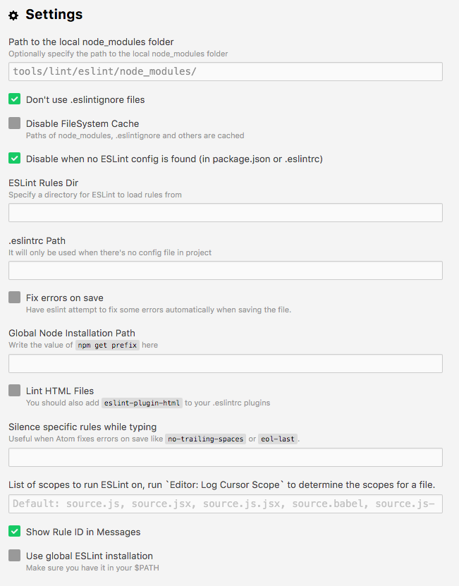
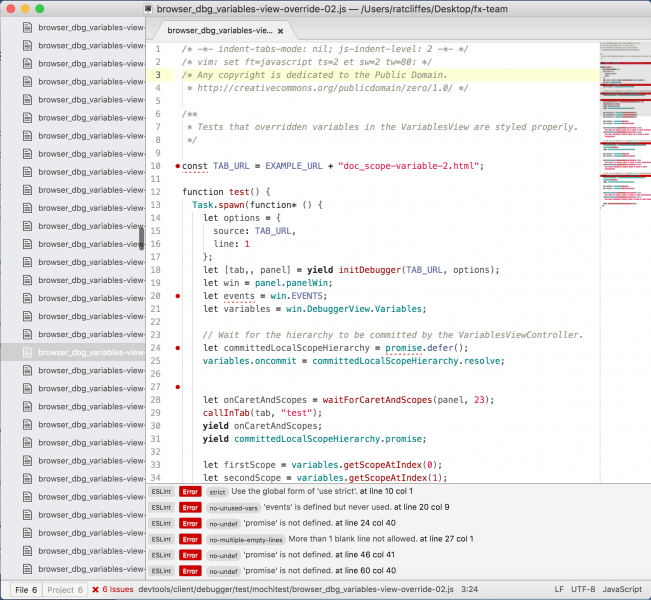

Due to some recent changes in the way that we use eslint to check that our coding style linting Mozilla source code in Atom has been broken for a month or two.

I have recently spent some time working on Atom's linter-eslint plugin making it possible to bring all of that linting goodness back to life!

From the root of the project type:

```shell
./mach eslint --setup
```

Install the linter-eslint package v.8.00 or above. Then go to the package settings and enable the following options:

<figure>



  <figcaption>Figure 1: Eslint Settings in Atom</figcaption>
</figure>

Once done, you should see errors and warnings as shown in the screenshot below:

<figure>



  <figcaption>Figure 1: Eslint in Atom</figcaption>
</figure>
