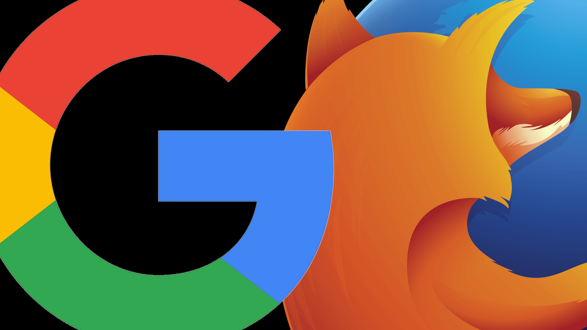
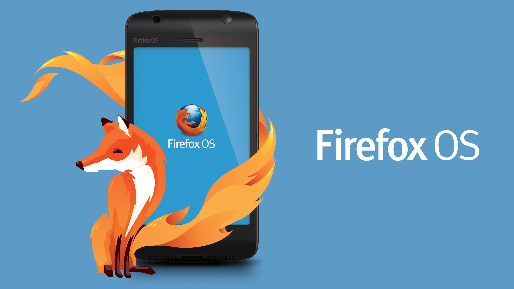
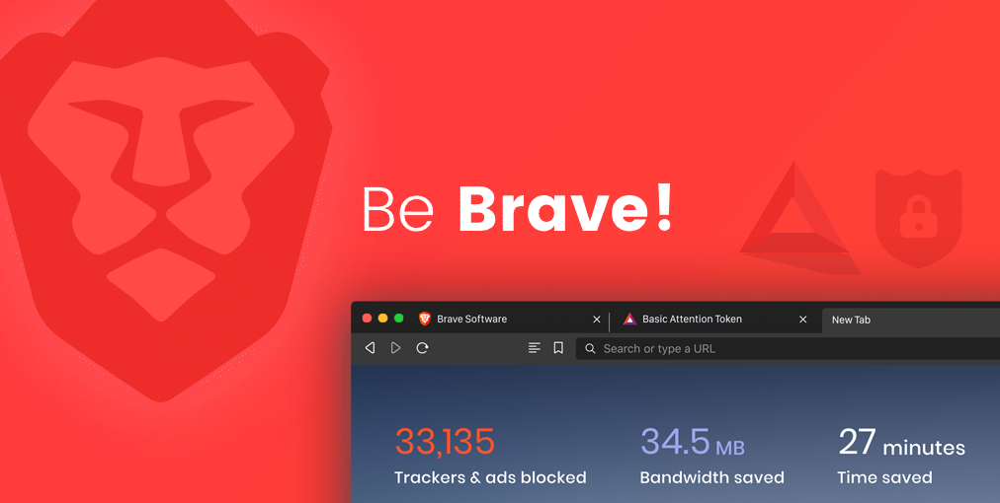

I have been an avid Firefox user since 2000 (back then it was called Netscape). I love Mozilla and all that it stands for. 13 years back I even moved my family from Switzerland to the UK so that I could continue working for Mozilla.

I am well known in the area that I live in for promoting Firefox all of the time. When we leave the house we often dress our kids in Firefox clothes and all three of my boys have Firefox posters and stickers all over their walls.

We went to the zoo a couple of weeks ago and all they cared about was seeing the red panda.

To help you understand why I have switched to Brave you first need to understand my relationship with Firefox.

## How Did I Start Using Firefox?

Back in 2000 I was at college looking at the Netscape 4 source code, when I discovered the [about:mozilla](https://en.wikipedia.org/wiki/The_Book_of_Mozilla) page. It fascinated me that Netscape was open source and that people could contribute to the source code.

At this time nobody was standing up to the likes of Microsoft and AOL so I was very impressed that there were people around the world making a stand and trying to keep the internet free and open to everybody.

At this point I started promoting Mozilla in any way that I could. I started to use Netscape on all my computers and was faithful to Mozilla ever since.

## My History With Mozilla

### From Firebug Contributor To Full-Time Employee

Around 2007 I started contributing to Firebug. At first I just fixed a few bugs in Firefox itself and then took over development of Firebug Lite (a bookmarklet version of Firebug). I eventually moved back to working on Firebug and eventually started working for Mozilla as a full time employee.

### Google: Mozilla's Greatest Rival

<figure>

  <figcaption>Google and Mozilla are rivals</figcaption>
</figure>

In 2008 Mozilla was due to renew their search deal with Google. Previous to this I had never questioned where their money came from. I was a little disheartened to learn that every time people searched Google from within a Firefox Browser, Google would receive a small amount of money. I didn't like this because Google are a large advertising company and they already had a reputation for not respecting their user's privacy.

In 2009 we started to become concerned that our user base was dropping. Chrome had been released and it was very fast. Our only other competitor was Internet Explorer but Chrome was taking more and more users away from us. We were surprised because it was already well known that Google were using Chrome to [gather information](https://en.wikipedia.org/wiki/Google_Chrome#Privacy) about their users browsing habits.

At this point I was still proud to be working for Mozilla because we were standing up to Microsoft and Google. At the same time I felt very uncomfortable that all of Mozilla's money was coming from their biggest rival, who truly stood for everything we were fighting against.

I spoke with management and they acknowledged that it was a problem. They said that they were actively looking into adding new revenue streams.

## Firefox OS: The Beginning Of The End

<figure>

  <figcaption>Firefox OS - formerly called BTG</figcaption>
</figure>

In a drive to release B2G (Firefox OS), Mozilla had to recruit hundreds of new developers. This seemed like a good idea because Mozilla needed an alternate revenue stream to Google but it has ultimately marked the beginning of the end for Mozilla.

In the early days, Mozilla was like one big family. We all believed in a free and open web and loved open source. Everybody's suggestions were important and taken seriously and we had freedom to be creative and make Firefox a success.

The new wave of developers that joined Mozilla were employed purely for their technical abilities. For many of them Mozilla was just a job whereas before this time it was a set of beliefs, a job and a lifestyle.

As the company grew there was also more and more bureaucracy involved and any suggestions or concerns would go up through the management chain and disappear into the ether. You could no longer email management and expect a response.

Developers were no longer given the time to be creative. You just had to work on an endless line of bugs and had very little input when it came to the creative process.

This is where Mozilla began to lose it's soul. We have seen the integration of Pocket and many failed attempts at integrating things like video conferencing. Adverts were even added to the `about:newtab` page.

Firefox looks more and more like Chrome. The rational behind making these changes is that it makes it easier for people to migrate from Chrome to Firefox. In my opinion the problem is that the people Firefox should be attracting are people that want something _different_ from Chrome so this is losing them users rather than gaining them.

## My Vision Of Firefox

<figure>

  <figcaption>I had an idea!</figcaption>
</figure>

Around 2004, Bill Gates said spam control in the future would be greatly improved. He proposed that email should become a paid service so that spammers would be forced to pay per email. It seemed like a reasonable idea but I wanted email to remain free.

In 2009 I remember talking with a a bunch of people about my vision of what Firefox should become. I explained that I thought people could choose to be paid to receive adverts. Private browsing should be completely private in my opinion so I suggested using Tor for our private browsing mode.

Unfortunately, it isn't practical to do that with Firefox because they would have to completely sever links with Google and then try to convince their users to sign up with their bank info or cryptocurrency accounts. In addition, it would mean setting up deals with advertisers and would prove very costly.

Around 2015 Mozilla dropped support for Firefox OS. This was a relief to me because I believed that the project was doomed from the start. Now we had lots of engineers that would focus 100% on the Firefox codebase.

At this point I suggested that we should stop maintaining and continually rewriting our codebase. It would make a lot more sense to migrate to the Chromium codebase because that is maintained by Google. Doing this would allow Mozilla to free up a whole army of developers to work creatively on various projects with the aim of bringing in that elusive non-Google revenue stream... kind of like a gigantic start-up. Not only that, the browser would look and act the same from a user's perspective.

This idea was also dismissed as being too risky so I suggested creating a second browser that implemented these things on it's own terms. This idea was discarded because it was also too risky.

To be honest it was very frustrating that my ideas were constantly dismissed. I have always intuitively known what people want from a product point of view but I know that many people are make their living by making those decisions.

## Mozilla's Mass Layoffs

<figure>

  <figcaption>Laid off</figcaption>
</figure>

I was part of Mozilla's first round of mass layoffs in 2020. I am first to admit that I felt betrayed as I had given my heart and soul to the company for such a long time. It wasn't just a job to me, it was what I believed in and a huge part of my lifestyle. At the same time, the writing had been on the wall for some time. Mozilla had lost it's way and had become _very_ different from the ground-breaking company that it used to be.

Many of us were surprised that most of the layoffs were senior developers and that made us employees acutely aware that the company was sacrificing senior developers with the goal of reducing it's financial obligations. With that came the realization that it wasn't a personal thing, it was an attempt to save the company.

## A Brave New World

<figure>

  <figcaption>Be Brave</figcaption>
</figure>

At this point I had heard of [Brave](https://brave.com/) but I had no idea what it was all about. I have always been very focused on the world of privacy but had come to the conclusion that we had to allow web advertising in order for the internet to prosper.

A months ago I decided to take a look at Brave. I was amazed to see what they have created a browser that did all of the things that I had suggested that Firefox should do. It is Chromium based and blocks all adverts.

You can specify a maximum amount of adverts (currently up to 10 per hour) that you are happy to receive and pay you a small amount of BAT for each advert that you received.

The browser itself is very snappy and responsive. It really is a pleasure to use.

If you click an `.onion` link it automatically opens in a new window running through the Tor network. In fact, if Brave "knows" the onion link for a site it will automatically open that onion link in a new window.

Their implementation really is great and it implements everything I wanted and more. I don't understand why Mozilla never did this back in the day when they could have done... lots of us had similar ideas.

The truth is that Brendan would have known about these things and knew that Mozilla wasn't willing to take the risk so he decided to spin up a company that would. The people at Brave haven't only managed to pull it off... they have pulled it off with swagger.

I just want to let the ladies and gentlemen at Brave know that they have done a great job in creating the Brave Browser.

I am very happy to be a member of this new family!
